authors: Alexandre Touret
summary: Code Quality Workshop
id: api-first-workshop
categories: api, java
environments: Web
status: Published
feedback link: https://github.com/alexandre-touret/api-first-workshop/issues

# API-First workshop

## Introduction

This workshop aims to:

- Look into the [API-First approach](https://www.postman.com/api-first/) and its benefits
- Present the methodologies and tools which could be used to streamline the develop process
- Pinpoint the common pitfalls of the API-First and how to avoid/leverage them.

During this workshop we will use different tools, practices and languages:

* [Java](https://www.java.com/) & [Quarkus](https://quarkus.io/) as a platform and programming language
* [OpenAPI Specification](https://swagger.io/specification/)
* [Vacuum](https://quobix.com/vacuum/) to validate the OpenAPI files
* [OASDIFF](https://www.oasdiff.com/) to pinpoint breaking changes and generate changelogs
* [Microcks](https://microcks.io/) to mock our API
* [JSONAPI](https://jsonapi.org/)

### Getting involved?

The source code is available on [GitHub](https://github.com/alexandre-touret/api-first-workshop/).

Feel free to raise [any issues](https://github.com/alexandre-touret/api-first-workshop/issues) or participate if you want!

## Overview

### Main functionalities

This platform exposes a set of API providing the following functionalities:

#### Guitar management

Handle the stock of guitars. The data is stored into a PostgreSQL database and exposed through the following API:

* ``GET /guitars`` : Fetches all the guitars
* ``POST /guitars``: Creates a guitar
* ``GET /guitars/pages``: Fetches all the guitars and paginate the results (_We will fix this ugly endpoint in the chapter about pagination & JSONAPI standard_)
* ``PUT /guitars/{guitarId}``: Updates one guitar
* ``GET /guitars/{guitarId}``: Gets one guitar
* ``DELETE /guitars/{guitarId}``: Removes one guitar

Here is a sample of one guitar entity:

```json
  {
  "guitarId": "831a3019-6be0-4e26-b904-a97d6608e6ca",
  "name": "Les Paul",
  "type": "ELECTRIC",
  "price": 3000,
  "stock": 2
}
```

#### Order Requests management

We create an orderRequest of one or many guitars and may ask for a discount. It will be challenged during the quote
creation.

The data is then stored into the PostgreSQL database too and exposed through the following API:

* ``GET /orders-requests`` : Fetches all the orderRequests
* ``POST /orders-requests``: Creates an orderRequest
* ``PUT /orders-requests/{orderId}``: Update one orderRequest

Here is a sample of one orderRequest entity:

```json
 {
  "orderId": "a4c25cca-37e5-47eE-D052-A27f0b8eA8ab",
  "guitarIds": [
    "CE8eDEaA-Ce12-6D18-7C35-1887a60514Ae"
  ],
  "discountRequested": 100,
  "createdAt": "2022-03-10T12:15:50-04:00"
}
```

#### Quote creation

After the orderRequest is stored, it's time to create a quote and provide it to our customers.

First and foremost, to check if the discount is fair, the system requests the[EBay Browse API](https://developer.ebay.com/api-docs/buy/browse/overview.html) to pinpoint what is the current price of this guitar on the market.
Then, if the stock is too low, the system broadcasts automatically a new command to the supply chain backoffice through
a Kafka Topic.

As above, the data is stored then into the PostgreSQL database and exposed through the following API:

* ``GET /quotes`` : Fetches all the quotes
* ``POST /quotes``: Creates a quote

Finally, here is a sample of a quote:

```json
{
  "orderId": "1711642e-e6be-406f-9a90-0be03f755ca8",
  "discount": 10,
  "totalPriceWithDiscount": 10,
  "createdAt": "2022-03-10T12:15:50-04:00"
}
```

### High level design

#### Context View

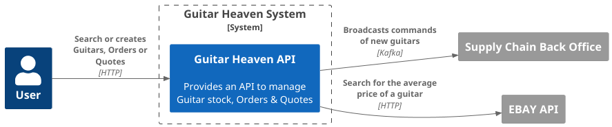

1. Our platform reaches the [EBAY Browse API](https://developer.ebay.com/api-docs/buy/browse/overview.html) to challenge the discount requested by the customer against the current price of
   the market on EBay.
2. When asking for a quote, if the current stock is too low (i.e., comparing to a threshold), it automatically broadcasts  a message to a Supply Chain Back Office through Kafka.

#### Container View


The business logic is implemented in a good old monolith built on a _light_ [Hexagonal Architecture way](https://en.wikipedia.org/wiki/Hexagonal_architecture_(software)).

To cut long story short, here is a short explanation of the packaging:

1. The API is located in the ``info.touret.guitarheaven.application``

```shell
src/main/java/info/touret/guitarheaven/application/
├── dto
│   ├── GuitarDto.java
│   ├── LinksDto.java
│   ├── OrderRequestDto.java
│   ├── PageableGuitarDto.java
│   └── QuoteDto.java
├── mapper
│   ├── ExceptionMapper.java
│   ├── GuitarMapper.java
│   ├── OrderRequestMapper.java
│   └── QuoteMapper.java
├── PaginationLinksFactory.java
└── resource
    ├── GuitarResource.java
    ├── OrderRequestResource.java
    └── QuoteResource.java

```

2. The business logic is implemented in the ``info.touret.guitarheaven.domain``

```shell
src/main/java/info/touret/guitarheaven/domain/
├── exception
│   ├── EntityNotFoundException.java
├── model
│   ├── Guitar.java
│   ├── OrderRequest.java
│   ├── Page.java
│   └── Quote.java
├── port
│   ├── GuitarPort.java
│   ├── OrderRequestPort.java
│   ├── QuotePort.java
│   ├── SupplierCatalogPort.java
│   └── SupplyChainPort.java
└── service
    ├── DiscountService.java
    ├── GuitarService.java
    ├── OrderRequestService.java
    └── QuoteService.java

```

3. The connection to the different backends (databases, message brokers, external API ) is implemented in the
   ``info.touret.guitarheaven.infrastructure``

```shell
src/main/java/info/touret/guitarheaven/infrastructure/
├── database
│   ├── adapter
│   │   ├── GuitarDBAdapter.java
│   │   ├── OrderRequestDBAdapter.java
│   │   └── QuoteDBAdapter.java
│   ├── entity
│   │   ├── GuitarEntity.java
│   │   ├── OrderRequestEntity.java
│   │   └── QuoteEntity.java
│   ├── mapper
│   │   ├── GuitarEntityMapper.java
│   │   ├── OrderRequestEntityMapper.java
│   │   └── QuoteEntityMapper.java
│   └── repository
│       ├── GuitarRepository.java
│       ├── OrderRequestRepository.java
│       └── QuoteRepository.java
├── ebay
│   ├── EbayClient.java
│   ├── EbayDiscounterAdapter.java
│   ├── Image.java
│   ├── ItemSummary.java
│   ├── Price.java
│   └── SearchPagedCollection.java
└── kafka
    ├── GuitarRequestDeserializer.java
    ├── GuitarRequest.java
    ├── GuitarRequestSerializer.java
    ├── KafkaClient.java
    └── SupplyChainAdapter.java
```

#### Quote creation workflow

You can check out the whole workflow below:


## Prerequisites

### Skills

| Skill                                     | Level        | 
|-------------------------------------------|--------------|
| [Java](https://www.oracle.com/java/)      | intermediate |   
| [Maven](https://www.maven.apache.org/)    | novice       |
| [Quarkus](https://quarkus.io)             | novice       |
| [REST API](https://www.maven.apache.org/) | proficient   |

### Icons & Conventions

Before starting, we will use the following icons during the workshop. Let us check their meaning:

🛠️ An action to perform,  
📝 A file to modify,  
👀 Something to observe,  
✅ Validate something,  
ℹ️ Some information.

### Tools

#### If you want to execute this workshop on your desktop with [DevContainers](https://containers.dev/)

I stored a configuration to set the project up in DevContainer. You can check it out in the project [``.devcontainer/devcontainer.json``](https://github.com/alexandre-touret/api-first-workshop/tree/main/.devcontainer) file.

If you want to know more about DevContainers, you can check out this [documentation](https://containers.dev/).

You **MUST** have set up these tools first:

* [Docker](https://docs.docker.com/)
* An IDE: ([IntelliJ IDEA](https://www.jetbrains.com/idea) or [VSCode](https://code.visualstudio.com/)).

🛠️ You can validate your environment running these commands:

**Docker**

```jshelllanguage
$ docker version
    Client:
    Docker Engine -Community
    Version:
    27.4.1
    API version:1.47
    Go version:go1.22.10
    Git commit:b9d17ea
    Built:Tue Dec 17 15:45:46 2024
    OS/Arch:linux/amd64
    Context:default

```

#### If you want to execute this workshop on your desktop (without DevContainer) 

You **MUST** have sat up these tools first:

* [Java 21+](https://adoptium.net/temurin/releases/?version=21)
* [Maven 3.9](https://www.maven.apache.org/)
* [Docker](https://docs.docker.com/)
* Any IDE ([IntelliJ IDEA](https://www.jetbrains.com/idea), [VSCode](https://code.visualstudio.com/), [Netbeans](https://netbeans.apache.org/),...) you want.

🛠️ You can validate your environment running these commands:

**Java**

```jshelllanguage
$ java -version
openjdk version "21.0.1" 2023 - 10 - 17 LTS
OpenJDK Runtime Environment Temurin-21.0.1 + 12 (build 21.0.1 + 12 - LTS)
OpenJDK 64-Bit Server VM Temurin-21.0.1+12(build21.0.1+12-LTS,mixed mode,sharing)
```

**Maven**

```jshelllanguage
$ mvn --version
Apache Maven 3.9.9 (8e8579a9e76f7d015ee5ec7bfcdc97d260186937)
Maven home: /home/alexandre/.sdkman/candidates/maven/current
Java version: 21.0.5, vendor: Eclipse Adoptium, runtime: /home/alexandre/.sdkman/candidates/java/21.0.5-tem
Default locale: en, platform encoding: UTF-8
OS name: "linux", version: "5.15.167.4-microsoft-standard-wsl2", arch: "amd64", family: "unix"
```

**Docker**

```jshelllanguage
$ docker version
Client:
Version:           27.2.1-rd
API version:       1.45 (downgraded from 1.47)
Go version:        go1.22.7
Git commit:        cc0ee3e
Built:             Tue Sep 10 15:41:39 2024
OS/Arch:           linux/amd64
Context:           default


```

**If you don't want to bother with a local setup**
It's strongly recommended to use [Github Codespaces](https://github.com/features/codespaces). You must create an account
first and [fork this repository](https://github.com/alexandre-touret/api-first-workshop/fork).

You can then open this project in either your local VS Code or directly in your browser.

**For the rest of this workshop, I will assume you will use GitHub CodeSpaces.**

## Environment Setup

> aside positive
> ℹ️ **What will you do and learn in this chapter?**
>
> You will set up the environment in Github Codespaces and understand how to run it

### 🛠  Open Github CodeSpaces

* Log on [GitHub](https://github.com/) and
  [fork this repository](https://github.com/alexandre-touret/api-first-workshop/fork).
* Click on ``Code>Codespaces>Create a codespace`` on the ``main`` branch

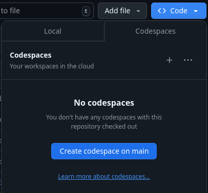

When a message invites you making a URL public, select and validate it.

Wait until the codeSpace is ready.

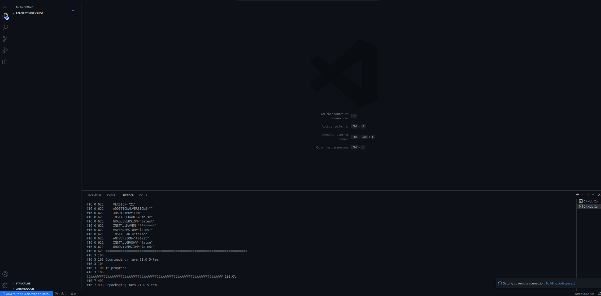

During the first startup, the maven build is automatically started. Please wait until it is completely finished.

### 🛠 Start the app

In a new terminal, start the Quarkus Dev environment:

```jshelllanguage
$ ./mvnw quarkus:dev
```

👀 Wait a while until you get the following output:

```jshelllanguage
2024-12-26 22:27:42,814INFO[io.quarkus](Quarkus Main Thread)guitar-heaven1.0.0-SNAPSHOT on JVM(powered by Quarkus3.17.4)started in27.006s.Listening on:http://localhost:8080
2024-12-26 22:27:42,815INFO[io.quarkus](Quarkus Main Thread)Profile dev activated.Live Coding activated.
2024-12-26 22:27:42,816INFO[io.quarkus](Quarkus Main Thread)Installed features:[agroal,cdi,hibernate-orm,hibernate-orm-panache,hibernate-validator,jdbc-postgresql,kafka-client,messaging,messaging-kafka,microcks,narayana-jta,rest,rest-client,rest-client-jackson,rest-jackson,resteasy-problem,smallrye-context-propagation,smallrye-openapi,swagger-ui,vertx]
```

ℹ️ All the stack is provided through the [Quarkus Dev Services](https://quarkus.io/guides/dev-services).
You don't therefore have to bother yourself about setting it up.

✅ Now validate your setup browsing the Quarkus DEV-UI. 

Go to the VS Code Port panel.

Select the port tab:

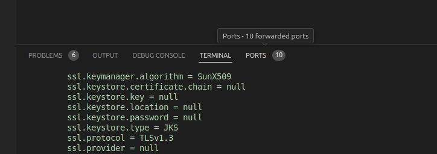

And now, go the URL which exposes the 8080 port:

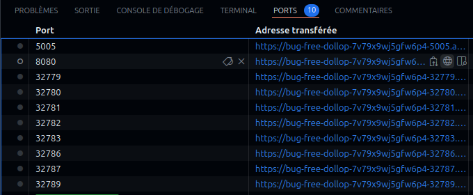

and add the ``/q/dev-ui`` suffix.

For instance: ``https://laughing-giggle-x5x4rqxpwfv5pj-8080.app.github.dev/q/dev-ui``

ℹ️ You can also browse the dev-ui to the ``Extensions>SmallRye OpenAPI``.

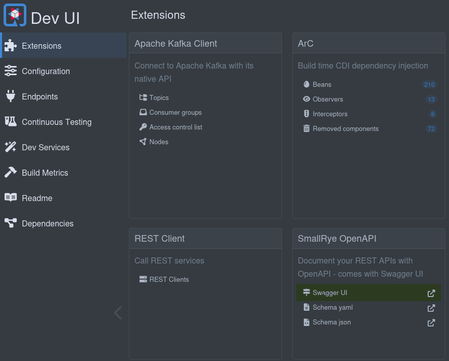

## Explore the current API

> aside positive
> ℹ️ **What will you do and learn in this chapter?**
>
> - Use the API
> - Check how smooth the onboarding is from a customer/user point of view.
> - Generate the changelog and pinpoint breaking changes in an OpenAPI contract
> - Pinpoint the main drawbacks of code first approach

### 👀 From a user perspective

Click then to ``SwaggerUI`` or go directly to the ``/q/swagger-ui/`` URI.

For instance: ``https://laughing-giggle-x5x4rqxpwfv5pj-8080.app.github.dev/q/swagger-ui``.

* Try out the different REST API queries.
* Check out the different samples

> aside positive
> Currently only the guitar names "Gibson ES 335" and "Fender Stratocaster" are configured on our Ebay Service Mock

> aside negative
>
> In your opinion, is the following example useful or representative of the domain?
> ```json
> {
>   "guitarId": "C75e0FCE-c9BF-4B3C-b8df-abA3fBb5aEcd",
>   "name": "S",
>   "type": "ELECTRIC",
>   "price": 0.1,
>   "stock": 1073741824
> }
> ```
>

### 👀 Under the Hood

Check out the API located in the ``info.touret.guitarheaven.application.resource`` package. Look into how the API documentation is generated.

```shell
tree src/main/java/info/touret/guitarheaven/application/
src/main/java/info/touret/guitarheaven/application/
└── resource
    ├── GuitarResource.java
    ├── OrderResource.java
    └── QuoteResource.java
```

In this projet, we used the Microprofile OpenAPI annotations.

For instance:

```java

@Operation(summary = "Gets all guitars")
@APIResponse(responseCode = "200", description = "Success ")
@APIResponse(responseCode = "500", description = "Server unavailable")
@GET
public List<GuitarDto> retrieveAllGuitars() {
    return guitarMapper.toGuitarsDto(guitarService.findAllGuitars());
}
```

#### Pinpoint drawbacks

For instance:

* How the error descriptions stick to their implementation?
* How to avoid gaps between the specification and the implementation?
* How to design & validate the API prior to coding it?
  ...

### 🛠 Validate the generated API

#### Automatic validation

🛠 Go to the generated OpenAPI through the ``Extensions>SmallRye OpenAPI`` menu (or through this URI ``/q/dev-ui/io.quarkus.quarkus-smallrye-openapi/schema-yaml``) and download the OPENAPI to the ``src/main/resources/openapi`` folder (create the ``openapi`` subfolder first).

Name it adding the suffix ``-code-first-openapi.yaml`` (e.g.,: ``guitarheaven-code-first-openapi.yaml``).

It is time to use a linter to validate the OpenAPI.
For this workshop, we will use [Vacuum](https://quobix.com/vacuum/).

Open a new shell in VSCode and run the following command at the project's root folder:

```shell
$ ./bin/vacuum.sh -d src/main/resources/openapi/guitarheaven-code-first-openapi.yaml
```

You would get the following output summary:

```shell
ategory     | Errors | Warnings | Info
Tags         | 0      | 11       | 0
Schemas      | 1      | 0        | 0
Descriptions | 0      | 30       | 20
Examples     | 0      | 54       | 0

                                                                                
          Linting file 'src/main/resources/openapi/guitarheaven-code-f          
          irst-openapi.yaml' failed with 1 errors, 95 warnings and 20           
          informs                                                               
                                                                                
```

ℹ️ The current issues seem insignificant. However, they would be harmful for your customers to:

* Understand your API
* Build mocks and the API client tooling.

#### Check manually the OpenAPI & pinpoint the differences

Open the OpenAPI

Check how the UUID are generated and validated:

* What are, in your view, the potential issues?
* How to fix them?

You could find in the file ``src/main/resources/openapi/guitarheaven-openapi.yaml`` several fixes of the generated OpenAPI to make it "Api-First (or Contract-First) compatible".

Let us check what are the differences:

First, check them using your code editor.
Then, let us use [OASDIFF](https://www.oasdiff.com/) to automatically pinpoint the differences and the potential breaking changes.

```shell
$ bin/oasdiff.sh diff /data/src/main/resources/openapi/guitarheaven-code-first-openapi.yaml /data/src/main/resources/openapi/guitarheaven-openapi.yaml
```

Remark: The ``/data`` prefix is only mentioned for assuring the compatibility with the Docker image used for running OASDIFF.

You would get such an output:

```yaml
 discount:
   min:
     from: null
     to: 0
   orderId:
     pattern:
       from: '[a-fA-F0-9]{8}-[a-fA-F0-9]{4}-[a-fA-F0-9]{4}-[a-fA-F0-9]{4}-[a-fA-F0-9]{12}'
       to: ""
   quoteId:
     pattern:
       from: '[a-fA-F0-9]{8}-[a-fA-F0-9]{4}-[a-fA-F0-9]{4}-[a-fA-F0-9]{4}-[a-fA-F0-9]{12}'
       to: ""

```

You can then generate the changelog with the following command:

```shell
$ bin/oasdiff.sh changelog /data/src/main/resources/openapi/guitarheaven-code-first-openapi.yaml /data/src/main/resources/openapi/guitarheaven-openapi.yaml
```

You would get such a content:

```shell
info    [request-parameter-pattern-removed] at /data/src/main/resources/openapi/guitarheaven-openapi.yaml       
        in API GET /guitars/{guitarId}
                removed the pattern '[a-fA-F0-9]{8}-[a-fA-F0-9]{4}-[a-fA-F0-9]{4}-[a-fA-F0-9]{4}-[a-fA-F0-9]{12}' from the 'path' request parameter 'guitarId'

info    [response-property-pattern-removed] at /data/src/main/resources/openapi/guitarheaven-openapi.yaml       
        in API GET /guitars/{guitarId}
                the 'name' response's property pattern '\S' was removed for the status '200'

```

You can also pinpoint the breaking changes with the following command:

```shell
$ bin/oasdiff.sh breaking /data/src/main/resources/openapi/guitarheaven-code-first-openapi.yaml /data/src/main/resources/openapi/guitarheaven-openapi.yaml
```

and get the output:

```shell

error   [request-property-type-changed] at /data/src/main/resources/openapi/guitarheaven-openapi.yaml   
        in API POST /quotes
                the 'orderId' request property type/format changed from 'string'/'' to 'string'/'uuid'

error   [request-property-type-changed] at /data/src/main/resources/openapi/guitarheaven-openapi.yaml   
        in API POST /quotes
                the 'quoteId' request property type/format changed from 'string'/'' to 'string'/'uuid'

```

> aside positive
>
> ℹ️ This tool can be easily integrated in a CI/CD process to validate the API on every commit and to automatically generate the changelog.
>

## Shift to API-First

> aside positive
> ℹ️ **What will you do and learn in this chapter?**
>
> - How to generate the API code from an OpenAPI file
    using [OpenAPI Generator](https://openapi-generator.tech/docs/plugins)
> - Check and fix the generated OpenAPI
> - How to easily remove the boilerplate code
> - Stick to the specification

### 📝 Update the Maven configuration

ℹ️ We will set up Maven to automatically generate the server code (i.e., model classes and API interfaces) from the OpenAPI file stored into the ``src/main/resources/openapi/guitarheaven-openapi.yaml`` file.

The corresponding source code will be generated in the ``target/generated-sources/openapi`` directory.

Let us do it!

* Stop the Quarkus application by typing ``q`` in the command prompt.
* Go to the ``pom.xml`` and update it as following:

In the ``build>plugins`` section, add the following plugin:

```xml

<plugin>
    <groupId>org.openapitools</groupId>
    <artifactId>openapi-generator-maven-plugin</artifactId>
    <version>7.10.0</version>
    <executions>
        <execution>
            <id>generate-server</id>
            <goals>
                <goal>generate</goal>
            </goals>
            <configuration>
                <inputSpec>${project.basedir}/src/main/resources/openapi/guitarheaven-openapi.yaml
                </inputSpec>
                <generatorName>jaxrs-spec</generatorName>
                <configOptions>
                    <apiPackage>info.touret.guitarheaven.application.generated.resource</apiPackage>
                    <modelPackage>info.touret.guitarheaven.application.generated.model</modelPackage>
                    <library>quarkus</library>
                    <dateLibrary>java8</dateLibrary>
                    <generateBuilders>true</generateBuilders>
                    <openApiNullable>false</openApiNullable>
                    <useBeanValidation>true</useBeanValidation>
                    <generatePom>false</generatePom>
                    <interfaceOnly>true</interfaceOnly>
                    <legacyDiscriminatorBehavior>false</legacyDiscriminatorBehavior>
                    <openApiSpecFileLocation>openapi/openapi.yaml</openApiSpecFileLocation>
                    <returnResponse>true</returnResponse>
                    <sourceFolder>.</sourceFolder>
                    <useJakartaEe>true</useJakartaEe>
                    <useMicroProfileOpenAPIAnnotations>true</useMicroProfileOpenAPIAnnotations>
                    <useSwaggerAnnotations>false</useSwaggerAnnotations>
                    <withXml>false</withXml>
                </configOptions>
                <output>${project.build.directory}/generated-sources/open-api-yaml</output>
                <ignoreFileOverride>${project.basedir}/.openapi-generator-ignore</ignoreFileOverride>
                <modelNameSuffix>Dto</modelNameSuffix>
            </configuration>
        </execution>
    </executions>
</plugin>

```

The plugin generates also useless classes for Quarkus. We can ignore their creation adding the file using the ``<ignoreFilesOverride>`` feature and creating the file ``.openapi-generator-ignore`` at the root of your project:

```properties
# Exclude Configurator classes
**/RestApplication.java
**/RestResourceRoot.java
pom.xml
```

Add then the following plugin in the ``build>plugins>`` section:

```xml

<plugin>
    <groupId>org.codehaus.mojo</groupId>
    <artifactId>build-helper-maven-plugin</artifactId>
    <version>3.6.0</version>
    <executions>
        <execution>
            <id>add-source</id>
            <phase>generate-sources</phase>
            <goals>
                <goal>add-source</goal>
            </goals>
            <configuration>
                <sources>
                    <source>${project.build.directory}/generated-sources/open-api-yaml</source>
                </sources>
            </configuration>
        </execution>
    </executions>
</plugin>

```

This configuration enables the support of two separate source folders in your project.

✅ Now let us check it. Run the following command:

```bash
$ ./mvnw clean compile
```

Normally, it ends successfully and you would get such an output:

```shell
[INFO] --- openapi-generator:7.9.0:generate (default) @ guitar-heaven ---
[WARNING] Generation using 3.1.0 specs is in development and is not officially supported yet. If you would like to expedite development, please consider working on the open issues in the 3.1.0 project: https://github.com/orgs/OpenAPITools/projects/4/views/1 and reach out to our team on Slack at https://join.slack.com/t/openapi-generator/shared_invite/zt-12jxxd7p2-XUeQM~4pzsU9x~eGLQqX2g
[INFO] Generating with dryRun=false
[INFO] OpenAPI Generator: jaxrs-spec (server)
[INFO] Generator 'jaxrs-spec' is considered stable.
[INFO] Environment variable JAVA_POST_PROCESS_FILE not defined so the Java code may not be properly formatted. To define it, try 'export JAVA_POST_PROCESS_FILE="/usr/local/bin/clang-format -i"' (Linux/Mac)
[INFO] NOTE: To enable file post-processing, 'enablePostProcessFile' must be set to `true` (--enable-post-process-file for CLI).
[INFO] Invoker Package Name, originally not set, is now derived from api package name: info.touret.guitarheaven.application.generated
[INFO] Processing operation retrieveAllGuitars
[INFO] Processing operation createGuitar
[INFO] Processing operation findAllGuitarsWithPagination
[INFO] Processing operation getGuitar
[INFO] Processing operation updateGuitar
[INFO] Processing operation deleteGuitar
[INFO] Processing operation getAllOrders
[INFO] Processing operation create
[INFO] Processing operation getOrder
[INFO] Processing operation findAll
[INFO] Processing operation createQuote
[INFO] 'host' (OAS 2.0) or 'servers' (OAS 3.0) not defined in the spec. Default to [http://localhost] for server URL [http://localhost/]
[WARNING] Generation using 3.1.0 specs is in development and is not officially supported yet. If you would like to expedite development, please consider working on the open issues in the 3.1.0 project: https://github.com/orgs/OpenAPITools/projects/4/views/1 and reach out to our team on Slack at https://join.slack.com/t/openapi-generator/shared_invite/zt-12jxxd7p2-XUeQM~4pzsU9x~eGLQqX2g
[INFO] 'host' (OAS 2.0) or 'servers' (OAS 3.0) not defined in the spec. Default to [http://localhost] for server URL [http://localhost/]
[INFO] 'host' (OAS 2.0) or 'servers' (OAS 3.0) not defined in the spec. Default to [http://localhost] for server URL [http://localhost/]
[WARNING] OffsetDateTime (reserved word) cannot be used as model name. Renamed to ModelOffsetDateTime
[INFO] writing file /home/alexandre/dev/src/api-first-workshop/target/generated-sources/openapi/./info/touret/guitarheaven/application/generated/model/GuitarDto.java
[INFO] writing file /home/alexandre/dev/src/api-first-workshop/target/generated-sources/openapi/./info/touret/guitarheaven/application/generated/model/LinksDto.java
[INFO] writing file /home/alexandre/dev/src/api-first-workshop/target/generated-sources/openapi/./info/touret/guitarheaven/application/generated/model/OrderDto.java
[INFO] writing file /home/alexandre/dev/src/api-first-workshop/target/generated-sources/openapi/./info/touret/guitarheaven/application/generated/model/PageableGuitarDto.java
[INFO] writing file /home/alexandre/dev/src/api-first-workshop/target/generated-sources/openapi/./info/touret/guitarheaven/application/generated/model/Quote.java
[INFO] writing file /home/alexandre/dev/src/api-first-workshop/target/generated-sources/openapi/./info/touret/guitarheaven/application/generated/model/QuoteDto.java
[INFO] writing file /home/alexandre/dev/src/api-first-workshop/target/generated-sources/openapi/./info/touret/guitarheaven/application/generated/model/TYPE.java
[INFO] 'host' (OAS 2.0) or 'servers' (OAS 3.0) not defined in the spec. Default to [http://localhost] for server URL [http://localhost/]
[INFO] writing file /home/alexandre/dev/src/api-first-workshop/target/generated-sources/openapi/./info/touret/guitarheaven/application/generated/resource/GuitarsApi.java
[INFO] 'host' (OAS 2.0) or 'servers' (OAS 3.0) not defined in the spec. Default to [http://localhost] for server URL [http://localhost/]
[INFO] writing file /home/alexandre/dev/src/api-first-workshop/target/generated-sources/openapi/./info/touret/guitarheaven/application/generated/resource/OrdersApi.java
[INFO] 'host' (OAS 2.0) or 'servers' (OAS 3.0) not defined in the spec. Default to [http://localhost] for server URL [http://localhost/]
[INFO] writing file /home/alexandre/dev/src/api-first-workshop/target/generated-sources/openapi/./info/touret/guitarheaven/application/generated/resource/QuotesApi.java
[INFO] Skipping generation of Webhooks.
[INFO] 'host' (OAS 2.0) or 'servers' (OAS 3.0) not defined in the spec. Default to [http://localhost] for server URL [http://localhost/]
[INFO] writing file /home/alexandre/dev/src/api-first-workshop/target/generated-sources/openapi/README.md
[INFO] Ignored /home/alexandre/dev/src/api-first-workshop/target/generated-sources/openapi/info/touret/guitarheaven/application/generated/RestResourceRoot.java (Ignored by rule in ignore file.)
[INFO] Ignored /home/alexandre/dev/src/api-first-workshop/target/generated-sources/openapi/info/touret/guitarheaven/application/generated/RestApplication.java (Ignored by rule in ignore file.)
[INFO] writing file /home/alexandre/dev/src/api-first-workshop/target/generated-sources/openapi/openapi/openapi.yaml
[INFO] writing file /home/alexandre/dev/src/api-first-workshop/target/generated-sources/openapi/src/main/resources/application.properties
[INFO] writing file /home/alexandre/dev/src/api-first-workshop/target/generated-sources/openapi/src/main/docker/Dockerfile.jvm
[INFO] writing file /home/alexandre/dev/src/api-first-workshop/target/generated-sources/openapi/src/main/docker/Dockerfile.native
[INFO] writing file /home/alexandre/dev/src/api-first-workshop/target/generated-sources/openapi/.dockerignore
[INFO] writing file /home/alexandre/dev/src/api-first-workshop/target/generated-sources/openapi/.openapi-generator-ignore
[INFO] writing file /home/alexandre/dev/src/api-first-workshop/target/generated-sources/openapi/.openapi-generator/VERSION
[INFO] writing file /home/alexandre/dev/src/api-first-workshop/target/generated-sources/openapi/.openapi-generator/FILES
################################################################################
# Thanks for using OpenAPI Generator.                                          #
# Please consider donation to help us maintain this project 🙏                 #
# https://opencollective.com/openapi_generator/donate                          #
################################################################################

```

The generated classes should be located then in the ``target/generated-sources/open-api-yaml`` folder.

Reload the project in your IDE to detect this new source folder.

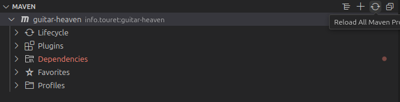

### 📝 Update the server code

#### DTO

Delete first the ``info.touret.guitarheaven.application.dto`` package.

#### API

For the following classes : ``GuitarResouce``, ``OrderRequestResource`` and ``QuoteResource``, do the following steps:

Change the import declarations of DTOs from ``info.touret.guitarheaven.application.dto`` to
``info.touret.guitarheaven.application.dto``:

For instance, from :

```java
import info.touret.guitarheaven.application.dto.GuitarDto;
import info.touret.guitarheaven.application.dto.PageableGuitarDto;
```

to

```java
import info.touret.guitarheaven.application.generated.model.GuitarDto;
import info.touret.guitarheaven.application.generated.model.PageableGuitarDto;
```

Declare the resources as implementing their Api (e.g., ``GuitarsApi``).

For example:

```java
public class GuitarResource implements GuitarsApi {...
```

> aside positive
> 👀 **What is this interface?**
>
> This class is the Java representation of the OpenAPI.
>
> By implementing it in your code, you must stick to the specification of your API. If not, your build will
> automatically fail.
>
> Try to modify the arguments of the implement methods or the OpenAPI and see what happens during the build time.

Remove all the Microprofile OpenAPI and the ``jakarta.ws.rs`` annotations (e.g. ``@GET``)

For instance:

```java
@Operation(summary = "Gets all guitars")
@APIResponse(responseCode = "200", description = "Success ")
@APIResponse(responseCode = "500", description = "Server unavailable")
@GET
```

Change all the method declarations.

Remove the ``jakarta.validation.constraints`` annotations such as ``@NotNull``

Instead of returning a POJO, you will have now to return a ``jakarta.ws.rs.core.Response`` object.

For instance:

```java
public Response findAll() {
    return Response.ok(quoteService.findAll()).build();
}
```

If a method requires now returning a response, you can use the ``Response.noContent().build()`` functionality.

For instance:

```java
public Response deleteGuitar(@NotNull UUID guitarId) {
    guitarService.deleteGuitarByUUID(guitarId);
    return Response.noContent().build();
}
```

Add the following imports:

```java
import jakarta.ws.rs.core.Response;
import jakarta.enterprise.context.ApplicationScoped;
```

At the end, you will have these API resource classes:

**GuitarResource**

```java
@ApplicationScoped
public class GuitarResource implements GuitarsApi {

    private final GuitarService guitarService;

    private final GuitarMapper guitarMapper;
    private final PaginationLinksFactory pageUtils;

    @Inject
    public GuitarResource(GuitarService guitarService, GuitarMapper guitarMapper, PaginationLinksFactory pageUtils) {
        this.guitarService = guitarService;
        this.guitarMapper = guitarMapper;
        this.pageUtils = pageUtils;
    }

    @Context
    private UriInfo uriInfo;

    @Override
    public Response retrieveAllGuitars() {
        return Response.ok(guitarMapper.toGuitarsDto(guitarService.findAllGuitars())).build();
    }

    @Override
    public Response createGuitar(GuitarDto guitarDto) {
        return Response.status(201).entity(Map.of("guitarId", guitarService.createGuitar(guitarMapper.toGuitar(guitarDto)))).build();
    }

    @Override
    public Response updateGuitar(UUID guitarId, GuitarDto guitarDto) {
        return Response.ok(guitarMapper.toGuitarDto(guitarService.updateGuitar(guitarMapper.toGuitar(guitarDto)))).build();
    }

    @Override
    public Response deleteGuitar(UUID guitarId) {
        var deleted = guitarService.deleteGuitarByUUID(guitarId);
        if (!deleted) {
            throw new WebApplicationException("Guitar {} not found", Response.Status.NOT_FOUND);
        }
        return Response.noContent().build();
    }


    @Override
    public Response getGuitar(UUID guitarId) {
        var guitars = guitarService.findGuitarsByGuitarIds(List.of(guitarId));
        if (guitars.isEmpty()) {
            throw new WebApplicationException("Guitar " + guitarId + " not found", Status.NOT_FOUND);
        } else {
            return Response.ok(guitarMapper.toGuitarDto(guitars.getFirst())).build();
        }
    }

    @Override
    public Response findAllGuitarsWithPagination(Integer pageNumber, Integer pageSize) {
        var guitarsByPage = guitarService.findAllGuitarsByPage(pageNumber, pageSize);
        try {
            return Response.ok(new PageableGuitarDto().guitars(guitarMapper.toGuitarsDto(guitarsByPage.entities())).links(pageUtils.createLinksDto(uriInfo, guitarsByPage, pageSize))).build();
        } catch (URISyntaxException | MalformedURLException e) {
            throw new WebApplicationException(Status.INTERNAL_SERVER_ERROR);
        }
    }
}
```

Don't take care of the mapper related errors. We will fix them later on.

**OrderRequestResource**

```java
@ApplicationScoped
public class OrderRequestResource implements OrdersRequestsApi {

    private final OrderRequestService orderRequestService;
    private final OrderRequestMapper orderRequestMapper;

    public OrderRequestResource(OrderRequestService orderRequestService, OrderRequestMapper orderRequestMapper) {
        this.orderRequestService = orderRequestService;
        this.orderRequestMapper = orderRequestMapper;
    }

    @Override
    public Response create(OrderRequestDto order) {
        return Response.status(201).entity(Map.of("orderId", orderRequestService.create(orderRequestMapper.toOrder(order)))).build();
    }

    @Override
    public Response getAllOrders() {
        return Response.ok(orderRequestMapper.toOrderDtoList(orderRequestService.findAllOrders())).build();
    }

    @Override
    public Response getOrder(UUID orderId) {
        return Response.ok(orderRequestMapper.toOrderDto(orderRequestService.findByUUID(orderId).orElseThrow(
                () -> new WebApplicationException(Response.Status.NOT_FOUND)))).build();
    }
}

```

**QuoteResource**

```java
@ApplicationScoped
public class QuoteResource implements QuotesApi {

    private final QuoteService quoteService;
    private final QuoteMapper quoteMapper;

    @Inject
    public QuoteResource(QuoteService quoteService, QuoteMapper quoteMapper) {
        this.quoteService = quoteService;
        this.quoteMapper = quoteMapper;
    }

    @Override
    public Response createQuote(QuoteDto quoteDto) {
        return Response.status(201).entity(Map.of("quoteId", quoteService.createQuote(quoteMapper.fromDto(quoteDto)))).build();
    }

    @Override
    public Response findAll() {
        return Response.ok(quoteService.findAll()).build();
    }
}

```

#### 📝 Mapper

For the ``GuitarMapper``, ``OrderRequestMapper`` and ``QuoteMapper`` located in the
``info.touret.guitarheaven.application.mapper`` package, update the import declaration in the same way as before.

For instance, you can update this import declaration:

```java
import info.touret.guitarheaven.application.dto.GuitarDto;
```

to

```java
import info.touret.guitarheaven.application.generated.model.GuitarDto;
```

#### 📝 PaginationLinksFactory

Update the import declaration as above and change the creation of the ``LinksDto`` class from:

```java
return new LinksDto(self, first, prev, next, last);
```

to:

```java
return new LinksDto().self(self.toString()).first(first.toString()).prev(prev.toString()).next(next.toString()).last(last.toString());
```

#### 📝 Integration tests

Change then the DTO creation in the integration tests : ``GuitarResourceTest``,``OrderRequestResourceTest`` and
``QuoteResourceTest``.

**``GuitarResourceTest``**
Update the ``GuitarDto`` creation:

ℹ️ _For this test and the followings, you can replace the test methods by the code below_

**``GuitarResourceTest``**

Update the ``GuitarDto`` creation lines

```java
@Order(2)
@Test
void should_create_successfully() {
    var guitar = new GuitarDto().guitarId(null).name("Gibson ES 135").type(TYPEDto.ELECTRIC).priceInUSD(1500.0).stock(10);
    RestAssured.given()
            .header("Content-Type", "application/json")
            .and()
            .body(guitar)
            .when()
            .post("/guitars")
            .then()
            .statusCode(201)
            .assertThat().body("guitarId", MatchesPattern.matchesPattern(UUID_REGEX));
}

@Order(3)
@Test
void should_update_successfully() {
    var guitar = new GuitarDto().guitarId(UUID.fromString("628766d4-fee3-46dd-8bcb-426cffb4d585")).name("Gibson ES 135").type(ELECTRIC).priceInUSD(2500.0).stock(9);
    RestAssured.given()
            .header("Content-Type", "application/json")
            .and()
            .body(guitar)
            .when()
            .put("/guitars/628766d4-fee3-46dd-8bcb-426cffb4d585")
            .then()
            .statusCode(200);
}
```

Update then the import declarations (see above in the API chapter)

Fix the static import.

Now the ``TYPE`` values are located in the ``info.touret.guitarheaven.application.generated.model.TYPEDto`` class.

The import of the ``ELECTRIC`` is now:

```java
import static ``info.touret.guitarheaven.application.generated.model.TYPEDto.ELECTRIC;
```

Finally, change the name of the method called ``price`` to ``priceInUSD``.

**``OrderRequestResourceTest``**

Update then the import declarations (see above in the API chapter)

Update in the same way the ``OrderRequestDto`` creation:

```java
 @Test
void should_create_order_successfully() {
    var orderDto = new OrderRequestDto().orderId(null).guitarIds(List.of(UUID.fromString("628766d4-fee3-46dd-8bcb-426cffb4d685"))).discountRequestedInUSD(10D).createdAt(OffsetDateTime.now());        
    RestAssured.given()
            .header("Content-Type", "application/json")
            .and()
            .body(orderDto)
            .when()
            .post("/orders-requests")
            .then()
            .statusCode(201)
            .assertThat().body("orderId", MatchesPattern.matchesPattern(UUID_REGEX));
    }

 @Test
 void should_fail_creating_order() {
 var orderDto = new OrderRequestDto().orderId(null).guitarIds(List.of(UUID.fromString("628766d4-fdd3-46dd-8bcb-426cffb4d685"))).discountRequestedInUSD(10D).createdAt(OffsetDateTime.now());   
      RestAssured.given()
         .header("Content-Type", "application/json")
         .and()
         .body(orderDto)
         .when()
         .post("/orders-requests")
         .then()
         .statusCode(417)
         .contentType(ContentType.fromContentType("application/problem+json"));

}
```

**``QuoteResourceTest``**

Update then the import declarations (see above in the API chapter) and the object creation:

```java
@Order(1)
@Test
void should_create_successfully() {
  var quote = new QuoteDto().quoteId(null).orderId(UUID.fromString("292a485f-a56a-4938-8f1a-bbbbbbbbbbc1")).discountInUSD(10D).totalPriceWithDiscountInUSD(null).createdAt(OffsetDateTime.now());                
  RestAssured.given()
        .header("Content-Type", "application/json")
                .and()
                .body(quote)
                .when()
                .post("/quotes")
                .then()
                .statusCode(201)
                .assertThat().body("quoteId", MatchesPattern.matchesPattern(UUID_REGEX));

}

@Order(3)
@Test
void should_create_and_fail() {
  var quote = new QuoteDto().quoteId(null).orderId(UUID.fromString("292a485f-a56a-4938-8f1a-bbbbbbbbbbb9")).discountInUSD(10D).totalPriceWithDiscountInUSD(null).createdAt(OffsetDateTime.now());                
  RestAssured.given()
        .header("Content-Type", "application/json")
                .and()
                .body(quote)
                .when()
                .post("/quotes")
                .then()
                .statusCode(417).contentType(ContentType.fromContentType("application/problem+json"));
}
```


**``OrderRequestResourceTest``**

Update then the import declarations (see above in the API chapter)

Update in the same way the ``OrderRequestDto`` creation:

```java
 @Test
void should_create_order_successfully() {
    var orderDto = new OrderRequestDto().orderId(null).guitarIds(List.of(UUID.fromString("628766d4-fee3-46dd-8bcb-426cffb4d685"))).discountRequestedInUSD(10D).createdAt(OffsetDateTime.now());        
    RestAssured.given()
            .header("Content-Type", "application/json")
            .and()
            .body(orderDto)
            .when()
            .post("/orders-requests")
            .then()
            .statusCode(201)
            .assertThat().body("orderId", MatchesPattern.matchesPattern(UUID_REGEX));
    }

 @Test
 void should_fail_creating_order() {
 var orderDto = new OrderRequestDto().orderId(null).guitarIds(List.of(UUID.fromString("628766d4-fdd3-46dd-8bcb-426cffb4d685"))).discountRequestedInUSD(10D).createdAt(OffsetDateTime.now());   
      RestAssured.given()
         .header("Content-Type", "application/json")
         .and()
         .body(orderDto)
         .when()
         .post("/orders-requests")
         .then()
         .statusCode(417)
         .contentType(ContentType.fromContentType("application/problem+json"));

}
```

**``QuoteResourceTest``**

Update then the import declarations (see above in the API chapter) and the object creation:

```java
@Order(1)
@Test
void should_create_successfully() {
  var quote = new QuoteDto().quoteId(null).orderId(UUID.fromString("292a485f-a56a-4938-8f1a-bbbbbbbbbbc1")).discountInUSD(10D).totalPriceWithDiscountInUSD(null).createdAt(OffsetDateTime.now());                
  RestAssured.given()
        .header("Content-Type", "application/json")
                .and()
                .body(quote)
                .when()
                .post("/quotes")
                .then()
                .statusCode(201)
                .assertThat().body("quoteId", MatchesPattern.matchesPattern(UUID_REGEX));

}

@Order(3)
@Test
void should_create_and_fail() {
  var quote = new QuoteDto().quoteId(null).orderId(UUID.fromString("292a485f-a56a-4938-8f1a-bbbbbbbbbbb9")).discountInUSD(10D).totalPriceWithDiscountInUSD(null).createdAt(OffsetDateTime.now());                
  RestAssured.given()
        .header("Content-Type", "application/json")
                .and()
                .body(quote)
                .when()
                .post("/quotes")
                .then()
                .statusCode(417).contentType(ContentType.fromContentType("application/problem+json"));
}
```

#### Unit Tests

Go to the ``info.touret.guitarheaven.test.application.PaginationLinksFactoryTest`` test.

Change the ``setUp`` method as following:

```java
@BeforeEach
    void setUp() {
        paginationLinksFactory = new PaginationLinksFactory();
        List<GuitarDto> guitarDtoList = List.of(GuitarDto.builder().guitarId(UUID.fromString("628766d4-fee3-46dd-8bcb-426cffb4d585")).name("Gibson ES 335").type(ELECTRIC).priceInUSD(2500D).stock(9).build());
        page = new Page<GuitarDto>(1,guitarDtoList,0,false,false);
    }

```
And update the ``should_return_a_list_successfully()`` method as below:

```java
@Test
void should_return_a_list_successfully() throws MalformedURLException, URISyntaxException {
  when(uriInfo.getAbsolutePath()).thenReturn(URI.create("http://serverhost/test"));
  paginationLinksFactory.createLinksDto(uriInfo, page, 10);
  assertFalse(page.hasNext());
  assertFalse(page.hasPrevious());
  assertEquals(1, page.pageCount());
  assertEquals(UUID.fromString("628766d4-fee3-46dd-8bcb-426cffb4d585"), page.entities().getFirst().getGuitarId());
}
```

Update the Import to use the generated code instead of the deleted one.

#### 🛠 Validation

Run finally the following command:

```shell
$ ./mvnw clean verify
```

It might be successful.

Now, you can run again the application and go to the ``dev-ui``:

```shell
$ ./mvnw quarkus:dev
```

## Improve the OpenAPI contracts
### 👀 Object Naming

It is important to make our API fully agnostic. What is why we removed the ``Dto`` suffixes and made some arrangements with the OpenAPI code:

#### 📝 Dto

To do that and keep them in the code we applied the following configuration parameter into the
``build>plugins>openapi-generator-maven-plugin>configuration``

```xml
<modelNameSuffix>Dto</modelNameSuffix>
```

#### 📝 Date Time
Check out the generated OpenAPI it declares an ``OffsetDateTime`` schema type. It is useless. You can use this instead:

```yaml
createdAt:
  type: string
  format: date-time
```

#### Other Data Constraints

Check out the Open API and add when it is necessary, the different constraints to the different schemas and endpoints:

* [``minimum``](https://swagger.io/docs/specification/v3_0/data-models/data-types/#arrays)
* [``minItems``](https://swagger.io/docs/specification/v3_0/data-models/data-types/#arrays)
* [``required``](https://swagger.io/docs/specification/v3_0/describing-parameters/)


Next, generate the code and see how they are _"converted"_ into a Java code with the following command:

```shell
./mvnw clean compile
```

For instance for the ``OrderRequest`` object: 

```yaml
OrderRequest:
    type: object
    required:
      - guitarIds
    properties:
      orderId:
        type: string
        format: uuid
      guitarIds:
        type: array
        minItems: 1
        items:
          type: string
          format: uuid
      discountRequestedInUSD:
        type: number
        format: double
      createdAt:
        type: string
        format: date-time

```

For the ``Guitar`` schema we will have:

```yaml
    Guitar:
      type: object
      required:
        - name
        - type
      properties:
        guitarId:
          type: string
          format: uuid
        name:
          type: string
        type:
          $ref: "#/components/schemas/TYPE"
          type: string
        priceInUSD:
          type: number
          format: double
          minimum: 0
        stock:
          type: integer
          format: int32
          minimum: 0
```

We will have the corresponding generated Java code in the ``target/generated-sources/open-api-yaml/info/touret/guitarheaven/application/generated/model/`` folder:

```java
@org.eclipse.microprofile.openapi.annotations.media.Schema(description="")
@JsonTypeName("OrderRequest")
@jakarta.annotation.Generated(value = "org.openapitools.codegen.languages.JavaJAXRSSpecServerCodegen", date = "2025-01-07T20:15:49.979612552+01:00[Europe/Paris]", comments = "Generator version: 7.10.0")
public class OrderRequestDto   {
    private UUID orderId;
    private @Valid List<UUID> guitarIds = new ArrayList<>();
    private Double discountRequestedInUSD;
    private OffsetDateTime createdAt;

    public OrderRequestDto() {
    }

    /**
     **/
    public OrderRequestDto orderId(UUID orderId) {
        this.orderId = orderId;
        return this;
    }

    @org.eclipse.microprofile.openapi.annotations.media.Schema(description = "")
    @JsonProperty("orderId")
    public UUID getOrderId() {
        return orderId;
    }

    @JsonProperty("orderId")
    public void setOrderId(UUID orderId) {
        this.orderId = orderId;
    }


    @org.eclipse.microprofile.openapi.annotations.media.Schema(required = true, description = "")
    @JsonProperty("guitarIds")
    @NotNull  @Size(min=1)public List<UUID> getGuitarIds() {
        return guitarIds;
    }

    @JsonProperty("guitarIds")
    public void setGuitarIds(List<UUID> guitarIds) {
        this.guitarIds = guitarIds;
    }


    @org.eclipse.microprofile.openapi.annotations.media.Schema(description = "")
    @JsonProperty("discountRequestedInUSD")
    public Double getDiscountRequestedInUSD() {
        return discountRequestedInUSD;
    }

    @JsonProperty("discountRequestedInUSD")
    public void setDiscountRequestedInUSD(Double discountRequestedInUSD) {
        this.discountRequestedInUSD = discountRequestedInUSD;
    }

    @org.eclipse.microprofile.openapi.annotations.media.Schema(description = "")
    @JsonProperty("createdAt")
    public OffsetDateTime getCreatedAt() {
        return createdAt;
    }

    @JsonProperty("createdAt")
    public void setCreatedAt(OffsetDateTime createdAt) {
        this.createdAt = createdAt;
    }

```

> aside positive
>
> ℹ️ What about output validation?
> Usually, we only validate the data coming from the incoming requests. 
> 
> However, a good secure coding practice is to validate also the output. The more you will document your API and add data constraints, the easier it will be to validate both the input and the output data.
>

## Your API from a customer perspective

> aside positive
> ℹ️ **What will you do and learn in this chapter?**
>
> - Consider your API from a customer point of view
> - Use [Microcks](https://microcks.io/)
> - Add examples to your OpenAPI

### 👀 Explore Mirocks

To be in your customer's shoes, we will experiment how they would use your API during their development.
After testing the API through a [Swagger UI](https://editor.swagger.io/)
or [Redocly console](https://redocly.github.io/redoc/), they would probably integrate your API and mock it.

Among other things, mocking external API help isolate the code from external resources and streamline the [SDLC (Software
Development LifeCycle)](https://aws.amazon.com/what-is/sdlc/).

Some projects could help in this field : [Microcks](https://microcks.io/), [Wiremock](https://wiremock.org/), [MockServer](https://www.mock-server.com/).

In this workshop, we will use the first one. Beyond simply mocking external endpoints, it may help in contract testing and provides a standalone mock which could be sat up in an easy way.

Go to the dev-ui and select the ``Extensions>Microcks`` extension.

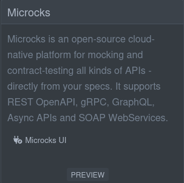

Select then ``APIs | Services``.

Click on ``Guitar Heaven API``.

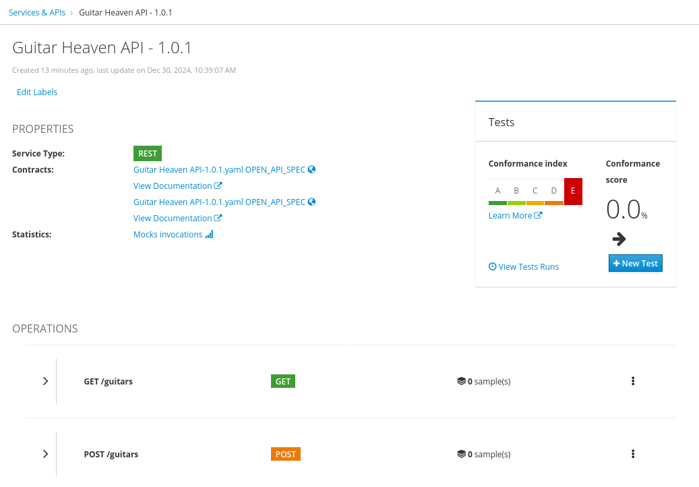

Check out the conformance index score.

Compare with the EBay Browse API.
As you can see, this is mainly due to the fact that no examples are provided in the OpenAPI.

### Add examples

For more information about OpenAPI examples,
you [can check out the specification](https://swagger.io/docs/specification/v3_0/adding-examples/).

To help you avoid wasting time with the examples, you can directly use the OpenAPI file
``guitarheaven-with-examples-openapi.yaml``.

Compare it with the last one to pinpoint the differences.

On the Microcks web page, open then the service ``Guitar Heaven API with Examples - 1.0.1``.
You will see the score is increased and now we have mocks.

You can now run any query you want.

For instance:

```shell
curl -X GET 'http://localhost:32805/rest/Guitar+Heaven+API+with+Examples/1.0.1/guitars' -H 'Accept: application/json'
```

You will get the output configured in the OpenAPI.

Let us dig into it and see what is under the hood:

If you look into the ``POST /guitars`` endpoint definition, you will see we coded examples for both the request and the results:

Here we specified the ``order_es335`` example

```yaml
    post:
      summary: Creates a guitar
      operationId: createGuitar
      requestBody:
        content:
          application/json:
            schema:
              $ref: "#/components/schemas/Guitar"
            examples:
              es335:
                value:
                  name: "ES 335"
                  type: ELECTRIC
                  priceInUSD: 2500
                  stock: 10
              stratocaster:
                value:
                  name: "Stratocaster"
                  type: ELECTRIC
                  priceInUSD: 1500
                  stock: 5
        required: true
      responses:
        "201":
          description: Guitar creation successful
          content:
            application/json:
              schema:
                type: object
                properties:
                  guitarId:
                    type: string
                    format: uuid
              examples:
                es335:
                  summary: ES 335 created
                  value:
                    guitarId: "756733e5-c247-49d8-bf40-9a481c2f0bc3"
                stratocaster:
                  summary: Stratocaster created
                  value:
                    guitarId: 628226d4-fee3-46dd-8bcb-426cffb4a665
        "400":
          description: 'The request is invalid '
        "500":
          description: Server unavailable

      tags:
        - Guitar Resource
```

In this way, your customer must stick to your specification during their tests.

Be aware, to be detected and usable in Microcks, the name of the examples declared in the request must also be declared in the response specification.

Now, how to deal with endpoints which don't return any content?

Microcks offers the ``x-microcks-refs`` extension attribute for that purpose:

For instance, for the ``DELETE /guitars`` endpoint:

```yaml
    delete:
      summary: Deletes a guitar
      operationId: deleteGuitar
      parameters:
        - name: guitarId
          in: path
          required: true
          schema:
            type: string
            format: uuid
          examples:
            es335:
              summary: "ES 335"
              value: 628226d4-fee3-46dd-8bcb-426cffb4a685
            stratocaster:
              summary: "Fender Stratocaster"
              value: 628226d4-fee3-46dd-8bcb-426cffb4a666
      responses:
        "204":
          description: 'Guitar update successful '
          x-microcks-refs:
            - es335
            - stratocaster
        "400":
          description: 'The request is invalid '
        "500":
          description: Server unavailable
      tags:
        - Guitar Resource

```

### Contract testing

We have now an API built using an OpenAPI description.
How to be fully sure your program fully complies with your specification? 

You can use the [Contract Testing](https://martinfowler.com/bliki/ContractTest.html) for that!

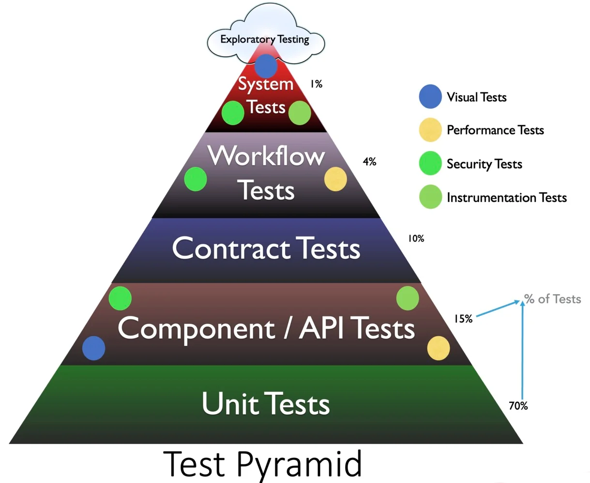

If you want to know more about contract testing, you can check out :
* [This documentation from Microsoft](https://microsoft.github.io/code-with-engineering-playbook/automated-testing/cdc-testing/).
* [This article from L BROUDOUX (Microcks)](https://medium.com/@lbroudoux/different-levels-of-api-contract-testing-with-microcks-ccc0847f8c97)
* [The introduction of conformance testing (Microcks)](https://microcks.io/documentation/explanations/conformance-testing/)

These tests could be implemented in a different ways:
* Testing against a  remote server to check if it is compliant with the OpenAPI specification
* Testing during the integration test phase (i.e., in a  ``@QuarkusTest``)

In this workshop, we will implement the latter.

Create the following class in the ``src/test/resouces`` directory and in the ``info.touret.guitarheaven.test.application`` package:

```java
package info.touret.guitarheaven.test.application;

import com.fasterxml.jackson.databind.ObjectMapper;
import io.github.microcks.testcontainers.MicrocksContainer;
import io.github.microcks.testcontainers.model.TestRequest;
import io.github.microcks.testcontainers.model.TestResult;
import io.github.microcks.testcontainers.model.TestRunnerType;
import io.quarkus.test.junit.QuarkusTest;
import jakarta.inject.Inject;
import org.eclipse.microprofile.config.inject.ConfigProperty;
import org.junit.jupiter.api.Test;
import org.slf4j.Logger;
import org.slf4j.LoggerFactory;

import static org.junit.jupiter.api.Assertions.assertTrue;

@QuarkusTest
public class APIContractTest {
    private final static Logger LOGGER = LoggerFactory.getLogger(APIContractTest.class);

    @ConfigProperty(name = "quarkus.http.test-port")
    int quarkusHttpPort;

    @ConfigProperty(name = "quarkus.microcks.default.http")
    String microcksContainerUrl;

    @Inject
    ObjectMapper mapper;

    @Test
    public void testOpenAPIContract() throws Exception {
        TestRequest testRequest = new TestRequest.Builder()
                .serviceId("Guitar Heaven API with Examples:1.0.1")
                .runnerType(TestRunnerType.OPEN_API_SCHEMA.name())
                .testEndpoint("http://host.testcontainers.internal:" + quarkusHttpPort)
                .build();
        TestResult testResult = MicrocksContainer.testEndpoint(microcksContainerUrl, testRequest);
        LOGGER.error(mapper.writerWithDefaultPrettyPrinter().writeValueAsString(testResult));
        assertTrue(testResult.isSuccess());
    }
}
```

Under the hood, this test will run Microcks and checks every endpoint declared in the OpenAPI using the examples filled earlier.

To check it, stop the Quarkus Dev and run the integration tests.

```shell
$ ./mvnw clean verify
```
It would end successfully.

## AsyncAPI & Event Driven API

> aside positive
> ℹ️ **What will you do and learn in this chapter?**
>
> - A sneak peek of the AsyncAPI standard 
> - How to keep having an API-First approach with asynchronous workflows
> - How to validate an event driven API specification

### 👀 Look into the existing code

Check out the infrastructure code in the package ``info.touret.guitarheaven.infrastructure.kafka`` and see how the connection to Kakfa is handled.

You could find the following classes:

* ``GuitarRequest``: The POJO used to broadcast messages through Kafka
* ``GuitarRequestDeserializer`` : A simple JSON deserializer
* ``GuitarRequestSerializer``: A simple JSON serializer
* ``KafkaClient``: The Kafka client used to broadcast & fetch messages
* ``SupplyChainAdapter``: The adapter of the domain's SupplyChainPort

If we want to apply the same principes we implemented earlier, this client layer should be generated from a specification.

How to do that for even-driven API?
The [AsyncAPI](https://www.asyncapi.com/) standard could help us in this challenge!

It is based on OpenAPI and specifies event-driven API accessible through Kafka, AMQP or MQTT.

### 🛠️ Draft an event-driven API

In this chapter, we will 
* See how to validate an AsyncAPI file
* Generate the POJO from it

First, create the file ``supplychain-asyncapi.yaml`` in the folder ``src/main/resources/asyncapi`` and copy the following content:

```yaml
asyncapi: 3.0.0
info:
  title: Guitar Supply Chain API
  version: 1.0.0
  description: This API is notified whenever the stock is too low

servers:
  dev:
    host: kafka://localhost:8092
    description: Kafka broker running in a Quarkus Dev Service
    protocol: kafka

operations:
  onGuitarRequestOut:
    action: send
    channel:
      $ref: '#/channels/guitar-requests-out'
  onGuitarRequestIn:
    action: receive
    channel:
      $ref: '#/channels/guitar-requests-in'

channels:
  guitar-requests-out:
    description: This channel is used to broadcast guitars supply requests
    address: guitar-requests
    messages:
      guitarRequest:
        $ref: '#/components/messages/guitarRequest'
  guitar-requests-in:
    description: This channel is used to fetch guitar requests
    address: guitar-requests
    messages:
      guitarRequest:
        $ref: '#/components/messages/guitarRequest'
components:
  messages:
    guitarRequest:
      name: guitarRequest
      title: Guitar Request
      contentType: application/json
      payload:
        $id: "GuitarRequest"
        $ref: '#/components/schemas/guitarRequest'
  schemas:
    guitarRequest:
      additionalProperties: false
      type: object
      properties:
        requestId:
          type: string
          format: uuid
          description: This property describes the UUID of the request
        guitarName:
          type: string
          description: This property describes the name of the guitar
        quantity:
          type: integer
          description: The quantity to order and supply

```

If you want to know more about the different elements, you can browse 
* [this notion explorer](https://www.asyncapi.com/docs/reference/specification/v3.0.0-explorer).
* [The spec](https://www.asyncapi.com/docs/concepts)

#### ✅ Validation 
The Async API initiative provides a bunch of tools. We will use some of them in this workshop [the cli](https://www.asyncapi.com/en/tools/cli) & the [generator](https://www.asyncapi.com/tools/generator). 

Unfortunately, the [generator](https://www.asyncapi.com/tools/generator) doesn't provide any model for Quarkus.

We will use it through its Docker image.

Run then the following command:

```shell
$ ./bin/asyncapi-validate.sh
```

You would get such an output:

```shell
bin/asyncapi-validate.sh 
Pulling & Running ASYNCAPIh  (command)  …asyncapi-validate.sh  (command)

AsyncAPI anonymously tracks command executions to improve the specification and tools, ensuring no sensitive data reaches our servers. It aids in comprehending how AsyncAPI tools are used and adopted, facilitating ongoing improvements to our specifications and tools.

To disable tracking, please run the following command:
  asyncapi config analytics --disable

Once disabled, if you want to enable tracking back again then run:
  asyncapi config analytics --enable


File /app/example/main/resources/asyncapi/supplychain-asyncapi.yaml is valid! File /app/example/main/resources/asyncapi/supplychain-asyncapi.yaml and referenced documents don't have governance issues.

```

If you want to edit it you can also use [the AsyncAPI studio](https://studio.asyncapi.com/).

#### 🛠️ Model Generation

_This chapter only illustrates the model generation at build time. We won't include this step in our app build workflow._

Run the following command:

```shell
$ ./bin/asyncapi-generate-model.sh
```

You would get the following output:

```shell
Pulling & Running ASYNCAPIh  (command)  …asyncapi-validate.sh  (command)

AsyncAPI anonymously tracks command executions to improve the specification and tools, ensuring no sensitive data reaches our servers. It aids in comprehending how AsyncAPI tools are used and adopted, facilitating ongoing improvements to our specifications and tools.

To disable tracking, please run the following command:
  asyncapi config analytics --disable

Once disabled, if you want to enable tracking back again then run:
  asyncapi config analytics --enable

│
 ›   Warning: Overwriting existing model with name guitarRequest, are there two models with the same name present? Overwriting the old model.
◇  Successfully generated the following models: GuitarRequest

```

and the generated class in the ``target/generated-sources/asyncapi`` folder.

#### Mocking your Event-Driven API

We can then mock our Event Driven API in the same way we did for our REST API.

Start Quarkus

```shell
$ ./mvnw quarkus:dev
```

Go then to the [Microcks extension page](https://quarkus.io/extensions/io.github.microcks.quarkus/quarkus-microcks/) and check out the ``Guitar Supply Chain API``.

You can see its conformance index is low. 
It is the same reason as before. 
We must therefore add examples. 

Now, import this new description with examples:

Create the ``supplychain-with-examples-asyncapi.yaml`` with the following content:

```yaml
asyncapi: 3.0.0
info:
  title: Guitar Supply Chain API
  version: 1.0.0
  description: This API is notified whenever the stock is too low

defaultContentType: application/json
channels:
  guitar-requests-out:
    address: guitar-requests
    description: Requests
    messages:
      guitarRequest.message:
        description: Event to ask a guitar
        payload:
          type: object
          additionalProperties: false
          properties:
            requestId:
              type: string
              format: uuid
            guitarName:
              type: string
            quantity:
              type: integer
        examples:
          - name: "Gibson ES 335"
            summary: "Example for Gibson ES 335"
            payload:
              requestId: ba4bf043-ee08-47c7-8b4f-75427d7213bf
              guitarName: "Gibson ES 335"
              quantity: 10
          - name: "Fender Stratocaster"
            summary: "Example for Fender Stratocaster"
            payload:
              requestId: ba4bf043-ee08-47c7-8b4f-75427d7213be
              guitarName: "Fender Stratocaster"
              quantity: 5
  guitar-requests-in:
    address: guitar-requests
    description: Requests
    messages:
      guitarRequest.message:
        description: Event to ask a guitar
        payload:
          type: object
          additionalProperties: false
          properties:
            requestId:
              type: string
              format: uuid
            guitarName:
              type: string
            quantity:
              type: integer
        examples:
          - name: "Gibson ES 335"
            summary: "Example for Gibson ES 335"
            payload:
              requestId: ba4bf043-ee08-47c7-8b4f-75427d7213bf
              guitarName: "Gibson ES 335"
              quantity: 10
          - name: "Fender Stratocaster"
            summary: "Example for Fender Stratocaster"
            payload:
              requestId: ba4bf043-ee08-47c7-8b4f-75427d7213be
              guitarName: "Fender Stratocaster"
              quantity: 5
operations:
  onGuitarRequestOut:
    action: send
    channel:
      $ref: '#/channels/guitar-requests-out'
    summary: Send command
    messages:
      - $ref: '#/channels/guitar-requests-out/messages/guitarRequest.message'
  onGuitarRequestin:
    action: receive
    channel:
      $ref: '#/channels/guitar-requests-in'
    summary: Fetches command
    messages:
      - $ref: '#/channels/guitar-requests-in/messages/guitarRequest.message'


servers:
  dev:
    host: kafka://localhost:8092
    description: Kafka broker running in a Quarkus Dev Service
    protocol: kafka

```

Go back to the [dev-ui Microcks web page](https://quarkus.io/extensions/io.github.microcks.quarkus/quarkus-microcks/).

Delete the ``Guitar Heaven Supply Chain API`` 

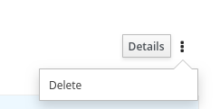

Go to the ``Importers`` menu and Click on ``Upload``

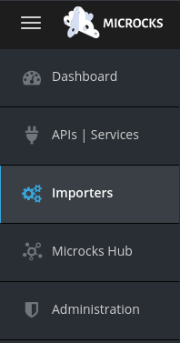

Select the new file and click on ``Upload``.

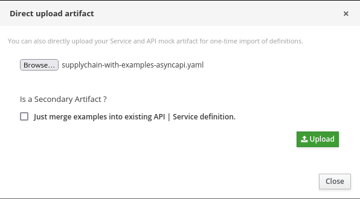

Go back to the ``APIs|Services`` menu and look into the ``Guitar Heaven Supply Chain API`` to check if there is samples now.

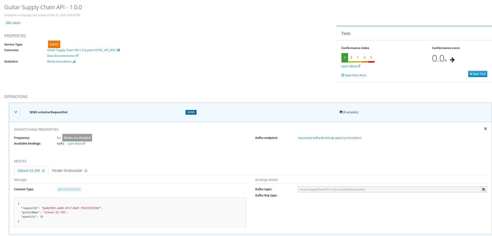

Unfortunately, we will not go further during this workshop. 

If you want to see a demo on how you can integrate Microcks & Kafka, you can check out [this example](https://github.com/microcks/microcks-quarkus-demo/blob/main/step-5-write-async-tests.md).

## Streamline the EBay API Client

> aside positive
> ℹ️ **What will you do and learn in this chapter?**
>
> - Generate an API client layer using the [``Quarkus OpenAPI Generator``](https://docs.quarkiverse.io/quarkus-openapi-generator/dev/index.html)

Now, let us streamline our API client.

Check out how the API Client is built in the ``info.touret.guitarheaven.infrastructure.ebay`` package.

We have the following classes:

* ``EbayDiscounterAdapter`` : The domain DiscountPort adapter
* ``EbayClient``: The API Client
* ``Image``, ``ItemSummary``,``Price``, ``SearchPagedCollection`` : The DTO

You can also browse the OpenAPI description located in the ``src/main/resources/openapi-client`` folder.

### Update the Maven configuration 

We need to enable the [Quarkus OpenAPI Generator extension](https://docs.quarkiverse.io/quarkus-openapi-generator/dev/index.html).

Add therefore a new dependency into the ``pom.xml``:

```xml
<dependency>
  <groupId>io.quarkiverse.openapi.generator</groupId>
  <artifactId>quarkus-openapi-generator</artifactId>
  <version>2.7.1-lts</version>
</dependency>
```

### Update the Quarkus configuration

We must define the Quarkus configuration extension with some items.  

In the file ``src/main/resources/application.properties`` add the following properties:

```properties
quarkus.openapi-generator.codegen.input-base-dir=src/main/resources/openapi-client
quarkus.openapi-generator.codegen.spec.ebay_buy_openapi_yaml.base-package=info.touret.guitarheaven.infrastructure.ebay
quarkus.openapi-generator.codegen.spec.ebay_buy_openapi_yaml.model-name-suffix=Dto
quarkus.openapi-generator.codegen.spec.ebay_buy_openapi_yaml.use-bean-validation=true
```

In both the files ``src/main/resources/application.properties`` and ``src/test/resources/application.properties`` add the following properties:
Remove the property ``quarkus.rest-client."info.touret.guitarheaven.infrastructure.ebay.EbayClient".url`` and add the new property:

```properties
quarkus.rest-client.ebay_buy_openapi_yaml.url=${quarkus.microcks.default.http}/rest/Browse+API/v1.19.9
```

### Update the Ebay API client code

Now, let us streamline our API Client code.

In the package ``info.touret.guitarheaven.infrastructure.ebay``, **ONLY** keep the ``EbayDiscounterAdapter`` class.  
Remove the others.

Modify the adapter with the following code:

```java
import info.touret.guitarheaven.domain.port.SupplierCatalogPort;
import info.touret.guitarheaven.infrastructure.ebay.api.ItemSummaryApi;
import io.quarkus.rest.client.reactive.ClientExceptionMapper;
import jakarta.enterprise.context.ApplicationScoped;
import jakarta.ws.rs.core.Response;
import org.eclipse.microprofile.rest.client.inject.RestClient;

import java.util.OptionalDouble;

@ApplicationScoped
public class EbayDiscounterAdapter implements SupplierCatalogPort {

    public static final int SEARCH_THRESHOLD = 1;
    @RestClient
    private ItemSummaryApi ebayClient;

    @Override
    public OptionalDouble getAverageGuitarPrice(String guitarName) {

        var searchPagedCollection = ebayClient.search(guitarName, "foo", "foo", "foo");

        if (searchPagedCollection.getTotal() > SEARCH_THRESHOLD) {
            return searchPagedCollection.getItemSummaries()
                    .stream()
                    .mapToDouble(value -> value.getPrice().getValue().doubleValue())
                    .average();
        } else return OptionalDouble.empty();
    }

    @ClientExceptionMapper
    static RuntimeException toException(Response response) {
        if (response.getStatus() == 400) {
            return new RuntimeException("The remote service responded with HTTP 400");
        }
        // Disabling some issues with the EBAY Mock
        return null;
    }
}
```

Update then the package imports:

From:

```java

```

To:


### Verification

Stop Quarkus.

Next, check if the code compiles:

```shell
$ ./mvnw clean compile
 ```

Check then if the integration tests run well:

```shell
$ ./mvnw clean verify
 ```

If you have this issue:

```bash
[ERROR] Failed to execute goal org.apache.maven.plugins:maven-clean-plugin:3.2.0:clean (default-clean) on project guitar-heaven: Failed to clean project: Failed to delete /home/alexandre/dev/src/api-first-workshop/target/generated-sources/asyncapi/info/touret/guitarheaven/infrastructure/kafka/generated/GuitarRequest.java -> [Help
```

Run the following command:

```shell
$ sudo rm -rf target/*
```

Now you can run the Quarkus app. The modification should be transparent in a customer point of view.

To check it, you can go to the SmallRye SwaggerUI and try the API.

## Update the API

> aside positive
> ℹ️ **What will you do and learn in this chapter?**
>
> - A bit of [the JSON API specification](https://jsonapi.org/examples/#pagination) and
    the [Hypertext Application Language (HAL)](https://stateless.co/hal_specification.html)  
> - How to update your API following the API-First Approach 


### JSONAPI Introduction

Check out (and try) how the pagination is handled on the ``GET /guitars/pages`` endpoint. It's based on [the JSON API specification](https://jsonapi.org/examples/#pagination) and the [Hypertext Application Language (HAL)](https://stateless.co/hal_specification.html).

> aside negative
> What about this standard?
>
> It is not really standard like [W3C](https://www.w3.org/standards/) or [IETF ones](https://www.ietf.org/process/rfcs). It is merely a _proposition_ of standardisation. I do not use as is. Nevertheless, some principles and patterns may be helpful such as the pagination.
> 
> Obviously, you can configure it in another way. One common and often used pattern is to avoid [HAL links](https://stateless.co/hal_specification.html).   

### Update the API

**We will base on our API on the ``guitarheaven-with-examples-openapi.yaml`` OpenAPI description.**

Update your ``pom.xml`` to use it instead of ``guitarheaven-openapi.yaml`` in the ``build>plugins>openapi-generator-maven-plugin`` section

```xml
<plugin>
  <groupId>org.openapitools</groupId>
  <artifactId>openapi-generator-maven-plugin</artifactId>
  <version>7.10.0</version>
  <executions>
      <execution>
          <id>generate-server</id>
          <goals>
              <goal>generate</goal>
          </goals>
          <configuration>
              <inputSpec>${project.basedir}/src/main/resources/openapi/guitarheaven-with-examples-openapi.yaml
              </inputSpec>
```

Copy-paste the ``guitarheaven-openapi-with-examples.yaml`` file and name the new file as ``guitarheaven-with-examples-openapi-ori.yaml``.  

First, go to the ``guitarheaven-openapi-with-examples.yaml`` and merge the definition of the ``GET /guitars`` and ``GET /guitars/pages`` endpoints.

For the following steps, you can use [the Swagger OpenAPI Editor](https://editor.swagger.io/).

Add the parameters and examples of the second one to the first one and remove the ``GET /guitars/pages`` endpoint.

Rename the ``PageableGuitar`` schema to ``Guitars``:

```yaml
    Guitars:
      type: object
      properties:
        guitars:
          type: array
          items:
            $ref: "#/components/schemas/Guitar"
        links:
          $ref: "#/components/schemas/Links"
```

Change the schema of the response content schema to : 

```yaml
content:
  application/json:
    schema:
      type: array
      items:
        $ref: "#/components/schemas/Guitars"
```

Rename the schema ``Guitar`` to ``Guitars``

```yaml
$ref: "#/components/schemas/Guitars"
```

We can also improve the constraints on the parameters adding the ``required``, ``maximum`` and ``minimum`` constraints.

You should therefore have the following endpoint:

```yaml
    get:
      summary: Gets all guitars
      operationId: findAllGuitarsWithPagination
      parameters:
        - name: pageNumber
          in: query
          required: true
          schema:
            type: integer
            format: int32
            minimum: 0
          examples:
            list:
              value: 0
        - name: pageSize
          in: query
          required: true
          schema:
            type: integer
            format: int32
            maximum: 10
          examples:
            list:
              value: 10
      responses:
        "200":
          description: 'Success '
          content:
            application/json:
              schema:
                $ref: "#/components/schemas/Guitars"
              examples:
                list:
                  value:
                    guitars:
                      - guitarId: "19fd8f49-745d-42e7-9e66-d0449442e3d1"
                        name: "ES 335"
                        type: "ELECTRIC"
                        priceInUSD: 2500
                        stock": 10
                      - guitarId: "5ef4d8fc-7d71-4599-a46e-c8693e7f5de7"
                        name: "Stratocaster"
                        type: "ELECTRIC"
                        priceInUSD: 1500
                        stock: 5
                      - guitarId: "0f29005c-cfac-4a6b-ba2f-7c21d7fbd3a2"
                        name: "Les Paul"
                        type: "ELECTRIC"
                        priceInUSD: 3000
                        stock: 2
                    links:
                      self: "http://localhost:8080/guitars/pages?pageNumber=http://localhost:8080/guitars/pages&pageSize=0"
                      first: "http://localhost:8080/guitars/pages?pageNumber=http://localhost:8080/guitars/pages&pageSize=0"
                      prev: "http://localhost:8080/guitars/pages?pageNumber=http://localhost:8080/guitars/pages&pageSize=0"
                      next: "http://localhost:8080/guitars/pages?pageNumber=http://localhost:8080/guitars/pages&pageSize=1"
                      last: "http://localhost:8080/guitars/pages?pageNumber=http://localhost:8080/guitars/pages&pageSize=9"
        "500":
          description: Server unavailable
      tags:
        - Guitar Resource

```

Rename the former API definition (``guitarheaven-with-examples-openapi-ORI.yaml``) with the following information:

```yaml
info:
  title: Guitar Heaven API with Examples ORI
  version: 1.0.1
  description: "Your guitar is probably here, check it out!"
  contact:
    name: Alexandre Touret
    email: techsupport@example.com
    url: https://blog.touret.info/contact/
  license:
    name: GPL v3
    url: https://www.gnu.org/licenses/gpl-3.0.en.html
```

To check this API, you can use ``vacuum``:

```shell
$ ./bin/vacuum.sh -d src/main/resources/openapi/guitarheaven-with-examples-openapi.yaml
```

### Pinpointing the differences

Now, let us check what are the differences and specially the breaking changes:

```shell
$ ./bin/oasdiff.sh diff /data/src/main/resources/openapi/guitarheaven-with-examples-openapi-ori.yaml /data/src/main/resources/openapi/guitarheaven-with-examples-openapi.yaml
```

### Updating the code

Stop Quarkus if it is still running.

Run the following command:

```shell
$ ./mvnw clean compile
```

Go to the ``GuitarResource``.

Remove the ``retrieveAllGuitars()`` method.

In the method ``findAllGuitarsWithPagination()`` `change the reference to ``PageableGuitarDto`` to ``GuitarsDto``.

You will get the following content:

```java
@Override
public Response findAllGuitarsWithPagination(Integer pageNumber, Integer pageSize) {
    var guitarsByPage = guitarService.findAllGuitarsByPage(pageNumber, pageSize);
    try {
        return Response.ok(new GuitarsDto().guitars(guitarMapper.toGuitarsDto(guitarsByPage.entities())).links(pageUtils.createLinksDto(uriInfo, guitarsByPage, pageSize))).build();
    } catch (URISyntaxException | MalformedURLException e) {
        throw new WebApplicationException(Status.INTERNAL_SERVER_ERROR);
    }
}
```

Remove the ``PageableGuitarDto`` import declaration.

### Updating the tests

In the class ``GuitarResourceTest``

Update the ``should_get_a_list_successfully()`` test with the following content:

```java
@Order(1)
@Test
void should_get_a_list_successfully() {
    RestAssured.given()
            .get("/guitars?pageNumber=0&pageSize=10")
            .then()
            .statusCode(200)
            .assertThat().body("isEmpty()", Is.is(false))
            .assertThat().body("links.size()", Is.is(5))
            .assertThat().body("links.self", IsAnything.anything())
            .assertThat().body("links.next", IsAnything.anything())
            .assertThat().body("links.last", IsAnything.anything())
            .assertThat().body("links.prev", IsAnything.anything())
            .assertThat().body("links.first", IsAnything.anything());
}
```

Update then the ``should_find_guitar_page_successfully()`` method:

```java
@Order(5)
@Test
void should_find_guitar_page_successfully() {
    RestAssured.given()
            .get("/guitars?pageNumber=0&pageSize=10")
            .then()
            .statusCode(200)
            .assertThat().body("links.size()", Is.is(5))
            .assertThat().body("links.self", IsAnything.anything())
            .assertThat().body("links.next", IsAnything.anything())
            .assertThat().body("links.last", IsAnything.anything())
            .assertThat().body("links.prev", IsAnything.anything())
            .assertThat().body("links.first", IsAnything.anything());
}
```

### Verification

Run the following command:

```shell
$ ./mvnw verify
```
It should be successful.

### Run Quarkus

You can finally check it live running Quarkus:

```shell
$ ./mvnw quarkus:dev 
```
