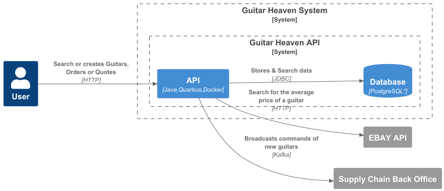

authors: Alexandre Touret 
summary: Code Quality Workshop
id: api-first-workshop
categories: api, java
environments: Web
status: Published
feedback link: https://github.com/alexandre-touret/api-first-workshop/issues

# API-First workshop

## Introduction

This workshop aims to:

- Look around the [API-First approach](https://www.postman.com/api-first/) and its benefits
- Present the methodologies and tools which could be used to streamline the develop process
- Pinpoint the common pitfalls of the API-First and how to avoid/leverage them.

During this workshop we will use different tools, practices and languages:

* [Java](https://www.java.com/) & [Quarkus](https://quarkus.io/) as a platform and programming language
* [OpenAPI Specification](https://swagger.io/specification/)
* [Vacuum](https://quobix.com/vacuum/) to validate the OpenAPI files
* [OASDIFF](https://www.oasdiff.com/) to pinpoint breaking changes and generate changelogs
* [Microcks](https://microcks.io/) for mocking our API
* [JSONAPI](https://jsonapi.org/)

### Getting involved?

The source code is available on [GitHub](https://github.com/alexandre-touret/api-first-workshop/).

Feel free to raise any issues or participate if you want!

## Overview

### Main functionalities
This platform exposes a set of APIs providing the following functionalities:

#### Guitar management
Handle the stock of guitars. The data is stored into a PostgreSQL database and exposed through the following API: 

* ``GET /guitars`` : Fetches all the guitars 
* ``POST /guitars``: Creates a guitar
* ``GET /guitars/pages``: Fetches all the guitars and paginate the results
* ``PUT /guitars/{guitarId}``: Update one guitar
* ``GET /guitars/{guitarId}``: Get one guitar
* ``DELETE /guitars/{guitarId}``: Removes one guitar
* ``GET /guitars``: Update one guitar

Here is a sample of one guitar entity:

```json
  {
    "guitarId": "831a3019-6be0-4e26-b904-a97d6608e6ca",
    "name": "Les Paul",
    "type": "ELECTRIC",
    "price": 3000,
    "stock": 2
  }
```

#### Order management

We create an order of one or many guitars and may ask for a discount. It will be challenged during the quote creation.

The data is then stored into the PostgreSQL database too and exposed through the following API:

* ``GET /orders`` : Fetches all the orders
* ``POST /orders``: Creates an order
* ``PUT /orders/{orderId}``: Update one order

Here is a sample of one order entity:

```json
 {
    "orderId": "a4c25cca-37e5-47eE-D052-A27f0b8eA8ab",
    "guitarIds": [
      "CE8eDEaA-Ce12-6D18-7C35-1887a60514Ae"
    ],
    "discountRequested": 100,
    "createdAt": "2022-03-10T12:15:50-04:00"
  }
```

#### Quote creation

After the order is stored, it's time to create a quote and provide it to our customers.
First and foremost, to check if the discount is fair, the system requests the eBay API to pinpoint what is the current price of this guitar on the market.
Then, if the stock is too low, the system broadcasts automatically a new command to the supply chain backoffice through a Kafka Topic.

As above, the data is stored then into the PostgreSQL database and exposed through the following API:

* ``GET /quotes`` : Fetches all the quotes
* ``POST /quotes``: Creates a quote

### High level design

#### Context View


1. Our platform reaches the EBAY API to challenge the discount requested by the customer against the current price of the market on EBay.
2. When asking for a quote, if the current stock is too low (i.e., comparing to a threshold, it automatically broadcasts a message to a Supply Chain Back Office through Kafka.

#### Container View



The business logic is implemented into a good old monolith built on a [Hexagonal Architecture way](https://en.wikipedia.org/wiki/Hexagonal_architecture_(software)).

To cut long story short, here is a short explanation of the packaging:

1. The API is located in the ``info.touret.guitarheaven.application``

```shell
tree src/main/java/info/touret/guitarheaven/application/
src/main/java/info/touret/guitarheaven/application/
├── dto
│   ├── GuitarDto.java
│   ├── LinksDto.java
│   ├── OrderDto.java
│   ├── PageableGuitarDto.java
│   └── QuoteDto.java
├── mapper
│   ├── ExceptionMapper.java
│   ├── GuitarMapper.java
│   ├── OrderMapper.java
│   └── QuoteMapper.java
├── PaginationLinksFactory.java
└── resource
    ├── GuitarResource.java
    ├── OrderResource.java
    └── QuoteResource.java

```
2. The business logic is implemented in the ``info.touret.guitarheaven.domain``

```shell
 tree src/main/java/info/touret/guitarheaven/domain/
src/main/java/info/touret/guitarheaven/domain/
├── exception
│   ├── EntityNotFoundException.java
│   └── GuitarOrderException.java
├── model
│   ├── Guitar.java
│   ├── Order.java
│   ├── Page.java
│   └── Quote.java
├── port
│   ├── GuitarPort.java
│   ├── OrderPort.java
│   ├── QuotePort.java
│   ├── SupplierCatalogPort.java
│   └── SupplyChainPort.java
└── service
    ├── DiscountService.java
    ├── GuitarService.java
    ├── OrderService.java
    └── QuoteService.java

```

3. The connection to the different backends (databases, message brokers, external API ) are implemented in the ``info.touret.guitarheaven.infrastructure``

```shell
tree src/main/java/info/touret/guitarheaven/infrastructure/
src/main/java/info/touret/guitarheaven/infrastructure/
├── database
│   ├── adapter
│   │   ├── GuitarDBAdapter.java
│   │   ├── OrderDBAdapter.java
│   │   └── QuoteDBAdapter.java
│   ├── entity
│   │   ├── GuitarEntity.java
│   │   ├── OrderEntity.java
│   │   └── QuoteEntity.java
│   ├── mapper
│   │   ├── GuitarEntityMapper.java
│   │   ├── OrderEntityMapper.java
│   │   └── QuoteEntityMapper.java
│   └── repository
│       ├── GuitarRepository.java
│       ├── OrderRepository.java
│       └── QuoteRepository.java
├── ebay
│   ├── EbayClient.java
│   ├── EbayDiscounterAdapter.java
│   ├── Image.java
│   ├── ItemSummary.java
│   ├── Price.java
│   └── SearchPagedCollection.java
└── kafka
    ├── GuitarRequestDeserializer.java
    ├── GuitarRequest.java
    ├── GuitarRequestSerializer.java
    ├── KafkaClient.java
    └── SupplyChainAdapter.java
```

#### Quote creation workflow

You can check out the whole workflow below:


## Prerequisites

### Skills

| Skill                                     | Level      | 
|-------------------------------------------|------------|
| [Java](https://www.oracle.com/java/)      | novice     |   
| [Maven](https://www.maven.apache.org/)    | novice     |
| [Quarkus](https://quarkus.io)             | novice     |
| [REST API](https://www.maven.apache.org/) | proficient |


### Icons & Conventions

Before starting, we will use the following icons during the workshop. Let us check their meaning:

🛠️ An action to perform,  
📝 A file to modify,  
👀 Something to observe,  
✅ Validate something,  
ℹ️ Some information.

### Tools
#### If you want to execute this workshop on your desktop

You **MUST** have set up these tools first:
* [Java 21+](https://adoptium.net/temurin/releases/?version=21)
* [Maven 3.9](https://www.maven.apache.org/)
* [Docker](https://docs.docker.com/)
* Any IDE ([IntelliJ IDEA](https://www.jetbrains.com/idea), [VSCode](https://code.visualstudio.com/), [Netbeans](https://netbeans.apache.org/),...) you want

🛠️ You can validate your environment running these commands:

**Java**

```jshelllanguage
$ java -version
openjdk version "21.0.1" 2023-10-17 LTS
OpenJDK Runtime Environment Temurin-21.0.1+12 (build 21.0.1+12-LTS)
OpenJDK 64-Bit Server VM Temurin-21.0.1+12 (build 21.0.1+12-LTS, mixed mode, sharing)
```

**Maven**

```jshelllanguage
$ mvn --version
Apache Maven 3.9.9 (8e8579a9e76f7d015ee5ec7bfcdc97d260186937)
Maven home:/home/alexandre/.sdkman/candidates/maven/current
Java version:21.0.4,vendor:Eclipse Adoptium,runtime:/home/alexandre/.sdkman/candidates/java/21.0.4-tem
Default locale:en,platform encoding:UTF-8
OS name:"linux",version:"5.15.153.1-microsoft-standard-wsl2",arch:"amd64",family:"unix"
```

**Docker**

```jshelllanguage
$ docker version
Client:
Docker Engine -Community
Version:
27.4.1
API version:1.47
Go version:go1.22.10
Git commit:b9d17ea
Built:Tue Dec 17 15:45:46 2024
OS/Arch:linux/amd64
Context:default

```

**If you don't want to bother with a local setup**
It's strongly recommended to use [Github Codespaces](https://github.com/features/codespaces). You must create an account
first and fork this repository. 

You can then open this project in either your local VS Code or directly in your browser.

ℹ️ If you still want to run it on your local desktop, you can also [use the devcontainer configuration stored in the project](https://github.com/alexandre-touret/api-first-workshop/tree/main/.devcontainer). 
For that, you MUST set up Docker before and open the project using either [VS Code](https://marketplace.visualstudio.com/items?itemName=ms-vscode-remote.remote-containers) or [Intellij Idea](https://www.jetbrains.com/help/idea/connect-to-devcontainer.html).

## Environment Setup

### Open Github Codespaces

* Log on [GitHub](https://github.com/) and fork [this repository](https://github.com/alexandre-touret/api-first-workshop).
* Click on ``Code>Codespaces>Create a codespace`` on the ``main`` branch


When a messages invites you making a URL public, select and validate it.

Wait until the codespace is ready.


During the first startup, the maven build is automatically started. Please wait until it is finished.

### Start the app

🛠 In a new terminal, start the Quarkus Dev environment:

```jshelllanguage
$ ./mvnw quarkus: dev
```

👀 Wait a while until you get the following output:

```jshelllanguage
2024 - 12 - 26 22:27:42,814INFO[io.quarkus](Quarkus Main Thread)guitar-heaven1.0.0-SNAPSHOT on JVM(powered by Quarkus3.17.4)started in27.006s.Listening on:http://localhost:8080
2024-12-26 22:27:42,815INFO[io.quarkus](Quarkus Main Thread)Profile dev activated.Live Coding activated.
2024-12-26 22:27:42,816INFO[io.quarkus](Quarkus Main Thread)Installed features:[agroal,cdi,hibernate-orm,hibernate-orm-panache,hibernate-validator,jdbc-postgresql,kafka-client,messaging,messaging-kafka,microcks,narayana-jta,rest,rest-client,rest-client-jackson,rest-jackson,resteasy-problem,smallrye-context-propagation,smallrye-openapi,swagger-ui,vertx]
```

ℹ️ All the stack is provided through the [Quarkus Dev Services](https://quarkus.io/guides/dev-services). 
You don't therefore have to bother yourself about ramping it up.

✅ Now validate your setup browsing the Quarkus DEV-UI. Go to the VS Code Port panel and click on the url exposing the port ``8080`` and add the ``/q/dev-ui`` suffix.

Select the port tab:


And now go the URL which exposes the 8080 port:


For instance: ``https://laughing-giggle-x5x4rqxpwfv5pj-8080.app.github.dev/q/dev-ui``

ℹ️ You can also browse the dev-ui to the ``Extensions>SmallRye OpenAPI``.


## Explore the current API

### From a user perspective

Click then to ``SwaggerUI`` or go to the ``/q/swagger-ui/`` URI. 

For instance: ``https://laughing-giggle-x5x4rqxpwfv5pj-8080.app.github.dev/q/swagger-ui``.

* 👀 Try the different REST API queries out.
* 👀 Check out (and try) how the pagination is handled on the ``GET /guitars/pages`` endpoint. It's based on [the JSON API specification](https://jsonapi.org/examples/#pagination) and the [Hypertext Application Language (HAL)](https://stateless.co/hal_specification.html).
* 👀 Check out the different samples

### Under the Hood

👀 Check out the API located in the ``info.touret.guitarheaven.application.resource`` package. See how the API documentation is generated.

```shell
tree src/main/java/info/touret/guitarheaven/application/
src/main/java/info/touret/guitarheaven/application/
└── resource
    ├── GuitarResource.java
    ├── OrderResource.java
    └── QuoteResource.java
```

In this projet, we used the Microprofile OpenAPI annotations. 

For instance:

```java
    @Operation(summary = "Gets all guitars")
    @APIResponse(responseCode = "200", description = "Success ")
    @APIResponse(responseCode = "500", description = "Server unavailable")
    @GET
    public List<GuitarDto> retrieveAllGuitars() {
        return guitarMapper.toGuitarsDto(guitarService.findAllGuitars());
    }
```

👀 Pinpoint the drawbacks:

A bunch of examples:
* How the error descriptions stick to their implementation?
* How to avoid gaps between the specification and the implementation?
* How to design & validate the API prior coding it?
...

### Validate the generated API

🛠 Go to the generated OpenAPI going to the ``Extensions>SmallRye OpenAPI`` menu (or going to this URI ``/q/dev-ui/io.quarkus.quarkus-smallrye-openapi/schema-yaml``) and download the OPENAPI to your ``src/main/resources`` folder.
Name it with a suffix ``openapi.yaml`` (for instance: ``guitarheaven-openapi.yaml``).

It is time to use a linter to validate the OpenAPI. 
For this workshop, we will use [Vacuum](https://quobix.com/vacuum/).

🛠 Open a new shell in VSCode and run the following command at the project's root folder:

```shell
$ bin/vacuum.sh -d src/main/resources/guitarheaven-openapi.yaml
```

ℹ️ The current issues seem insignificant. However, they would be noteworthy for your customers to: 
* Understand your API 
* Build mocks and the API client tooling. 

We will see that later on...   

## Moving our app to API-First

## What about the clients?

## AsyncAPI

## API-Breaking changes

## How our customers may integrate our API?
