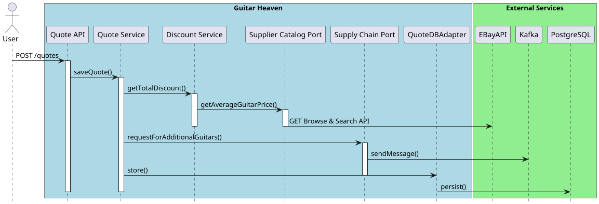

authors: Alexandre Touret
summary: Code Quality Workshop
id: api-first-workshop
categories: api, java
environments: Web
status: Published
feedback link: https://github.com/alexandre-touret/api-first-workshop/issues

# API-First workshop

## Introduction

This workshop aims to:

- Look around the [API-First approach](https://www.postman.com/api-first/) and its benefits
- Present the methodologies and tools which could be used to streamline the develop process
- Pinpoint the common pitfalls of the API-First and how to avoid/leverage them.

During this workshop we will use different tools, practices and languages:

* [Java](https://www.java.com/) & [Quarkus](https://quarkus.io/) as a platform and programming language
* [OpenAPI Specification](https://swagger.io/specification/)
* [Vacuum](https://quobix.com/vacuum/) to validate the OpenAPI files
* [OASDIFF](https://www.oasdiff.com/) to pinpoint breaking changes and generate changelogs
* [Microcks](https://microcks.io/) for mocking our API
* [JSONAPI](https://jsonapi.org/)

### Getting involved?

The source code is available on [GitHub](https://github.com/alexandre-touret/api-first-workshop/).

Feel free to raise any issues or participate if you want!

## Overview

### Main functionalities

This platform exposes a set of APIs providing the following functionalities:

#### Guitar management

Handle the stock of guitars. The data is stored into a PostgreSQL database and exposed through the following API:

* ``GET /guitars`` : Fetches all the guitars
* ``POST /guitars``: Creates a guitar
* ``GET /guitars/pages``: Fetches all the guitars and paginate the results
* ``PUT /guitars/{guitarId}``: Updates one guitar
* ``GET /guitars/{guitarId}``: Gets one guitar
* ``DELETE /guitars/{guitarId}``: Removes one guitar

Here is a sample of one guitar entity:

```json
  {
  "guitarId": "831a3019-6be0-4e26-b904-a97d6608e6ca",
  "name": "Les Paul",
  "type": "ELECTRIC",
  "price": 3000,
  "stock": 2
}
```

#### Order Requests management

We create an orderRequest of one or many guitars and may ask for a discount. It will be challenged during the quote
creation.

The data is then stored into the PostgreSQL database too and exposed through the following API:

* ``GET /orders-requests`` : Fetches all the orderRequests
* ``POST /orders-requests``: Creates an orderRequest
* ``PUT /orders-requests/{orderId}``: Update one orderRequest

Here is a sample of one orderRequest entity:

```json
 {
  "orderId": "a4c25cca-37e5-47eE-D052-A27f0b8eA8ab",
  "guitarIds": [
    "CE8eDEaA-Ce12-6D18-7C35-1887a60514Ae"
  ],
  "discountRequested": 100,
  "createdAt": "2022-03-10T12:15:50-04:00"
}
```

#### Quote creation

After the orderRequest is stored, it's time to create a quote and provide it to our customers.

First and foremost, to check if the discount is fair, the system requests the eBay API to pinpoint what is the current
price of this guitar on the market.
Then, if the stock is too low, the system broadcasts automatically a new command to the supply chain backoffice through
a Kafka Topic.

As above, the data is stored then into the PostgreSQL database and exposed through the following API:

* ``GET /quotes`` : Fetches all the quotes
* ``POST /quotes``: Creates a quote

Finally, here is a sample of a quote:

```json
{
  "orderId": "1711642e-e6be-406f-9a90-0be03f755ca8",
  "discount": 10,
  "totalPriceWithDiscount": 10,
  "createdAt": "2022-03-10T12:15:50-04:00"
}
```

### High level design

#### Context View


1. Our platform reaches the EBAY API to challenge the discount requested by the customer against the current price of
   the market on EBay.
2. When asking for a quote, if the current stock is too low (i.e., comparing to a threshold, it automatically broadcasts
   a message to a Supply Chain Back Office through Kafka.

#### Container View


The business logic is implemented in a good old monolith built on
a [Hexagonal Architecture way](https://en.wikipedia.org/wiki/Hexagonal_architecture_(software)).

To cut long story short, here is a short explanation of the packaging:

1. The API is located in the ``info.touret.guitarheaven.application``

```shell
src/main/java/info/touret/guitarheaven/application/
├── dto
│   ├── GuitarDto.java
│   ├── LinksDto.java
│   ├── OrderRequestDto.java
│   ├── PageableGuitarDto.java
│   └── QuoteDto.java
├── mapper
│   ├── ExceptionMapper.java
│   ├── GuitarMapper.java
│   ├── OrderRequestMapper.java
│   └── QuoteMapper.java
├── PaginationLinksFactory.java
└── resource
    ├── GuitarResource.java
    ├── OrderRequestResource.java
    └── QuoteResource.java

```

2. The business logic is implemented in the ``info.touret.guitarheaven.domain``

```shell
src/main/java/info/touret/guitarheaven/domain/
├── exception
│   ├── EntityNotFoundException.java
│   └── GuitarOrderException.java
├── model
│   ├── Guitar.java
│   ├── OrderRequest.java
│   ├── Page.java
│   └── Quote.java
├── port
│   ├── GuitarPort.java
│   ├── OrderRequestPort.java
│   ├── QuotePort.java
│   ├── SupplierCatalogPort.java
│   └── SupplyChainPort.java
└── service
    ├── DiscountService.java
    ├── GuitarService.java
    ├── OrderRequestService.java
    └── QuoteService.java

```

3. The connection to the different backends (databases, message brokers, external API ) is implemented in the
   ``info.touret.guitarheaven.infrastructure``

```shell
src/main/java/info/touret/guitarheaven/infrastructure/
├── database
│   ├── adapter
│   │   ├── GuitarDBAdapter.java
│   │   ├── OrderRequestDBAdapter.java
│   │   └── QuoteDBAdapter.java
│   ├── entity
│   │   ├── GuitarEntity.java
│   │   ├── OrderRequestEntity.java
│   │   └── QuoteEntity.java
│   ├── mapper
│   │   ├── GuitarEntityMapper.java
│   │   ├── OrderRequestEntityMapper.java
│   │   └── QuoteEntityMapper.java
│   └── repository
│       ├── GuitarRepository.java
│       ├── OrderRequestRepository.java
│       └── QuoteRepository.java
├── ebay
│   ├── EbayClient.java
│   ├── EbayDiscounterAdapter.java
│   ├── Image.java
│   ├── ItemSummary.java
│   ├── Price.java
│   └── SearchPagedCollection.java
└── kafka
    ├── GuitarRequestDeserializer.java
    ├── GuitarRequest.java
    ├── GuitarRequestSerializer.java
    ├── KafkaClient.java
    └── SupplyChainAdapter.java
```

#### Quote creation workflow

You can check out the whole workflow below:



## Prerequisites

### Skills

| Skill                                     | Level      | 
|-------------------------------------------|------------|
| [Java](https://www.oracle.com/java/)      | novice     |   
| [Maven](https://www.maven.apache.org/)    | novice     |
| [Quarkus](https://quarkus.io)             | novice     |
| [REST API](https://www.maven.apache.org/) | proficient |

### Icons & Conventions

Before starting, we will use the following icons during the workshop. Let us check their meaning:

🛠️ An action to perform,  
📝 A file to modify,  
👀 Something to observe,  
✅ Validate something,  
ℹ️ Some information.

### Tools

#### If you want to execute this workshop on your desktop

You **MUST** have set up these tools first:

* [Java 21+](https://adoptium.net/temurin/releases/?version=21)
* [Maven 3.9](https://www.maven.apache.org/)
* [Docker](https://docs.docker.com/)
* Any
  IDE ([IntelliJ IDEA](https://www.jetbrains.com/idea), [VSCode](https://code.visualstudio.com/), [Netbeans](https://netbeans.apache.org/),...)
  you want

🛠️ You can validate your environment running these commands:

**Java**

```jshelllanguage
$ java -version
    openjdk version "21.0.1" 2023 - 10 - 17 LTS
    OpenJDK Runtime Environment Temurin-21.0.1 + 12 (build 21.0.1 + 12 - LTS)
    OpenJDK 64-Bit Server VM Temurin-21.0.1+12(build21.0.1+12-LTS,mixed mode,sharing)
```

**Maven**

```jshelllanguage
$ mvn --version
    Apache Maven 3.9.9 (8e8579a9e76f7d015ee5ec7bfcdc97d260186937)
    Maven home:/home/alexandre/.sdkman/candidates/maven/current
    Java version:21.0.4,vendor:Eclipse Adoptium,runtime:/home/alexandre/.sdkman/candidates/java/21.0.4-tem
    Default locale:en,platform encoding:UTF-8
    OS name:"linux",version:"5.15.153.1-microsoft-standard-wsl2",arch:"amd64",family:"unix"
```

**Docker**

```jshelllanguage
$ docker version
    Client:
    Docker Engine -Community
    Version:
    27.4.1
    API version:1.47
    Go version:go1.22.10
    Git commit:b9d17ea
    Built:Tue Dec 17 15:45:46 2024
    OS/Arch:linux/amd64
    Context:default

```

**If you don't want to bother with a local setup**
It's strongly recommended to use [Github Codespaces](https://github.com/features/codespaces). You must create an account
first and fork this repository.

You can then open this project in either your local VS Code or directly in your browser.

> aside positive
>
> ℹ️ If you still want to run it on your local desktop, there is an alternative: you
> can [use the devcontainer configuration stored in the project](https://github.com/alexandre-touret/api-first-workshop/tree/main/.devcontainer).
>
> To do that, you MUST set up Docker before and open the project using
> either [VS Code](https://marketplace.visualstudio.com/items?itemName=ms-vscode-remote.remote-containers)
> or [Intellij Idea](https://www.jetbrains.com/help/idea/connect-to-devcontainer.html).

## Environment Setup

> aside positive
> ℹ️ **What will you do and learn in this chapter?**
>
> You will set up the environment and understand how to run it

### Open Github Codespaces

* Log on [GitHub](https://github.com/) and
  fork [this repository](https://github.com/alexandre-touret/api-first-workshop).
* Click on ``Code>Codespaces>Create a codespace`` on the ``main`` branch


When a messages invites you making a URL public, select and validate it.

Wait until the codespace is ready.


During the first startup, the maven build is automatically started. Please wait until it is finished.

### 🛠 Start the app

In a new terminal, start the Quarkus Dev environment:

```jshelllanguage
$. / mvnw quarkus:
dev
```

👀 Wait a while until you get the following output:

```jshelllanguage
2024 - 12 - 26 22:27:42,814INFO[io.quarkus](Quarkus Main Thread)guitar-heaven1.0.0-SNAPSHOT on JVM(powered by Quarkus3.17.4)started in27.006s.Listening on:http://localhost:8080
    2024-12-26 22:27:42,815INFO[io.quarkus](Quarkus Main Thread)Profile dev activated.Live Coding activated.
    2024-12-26 22:27:42,816INFO[io.quarkus](Quarkus Main Thread)Installed features:[agroal,cdi,hibernate-orm,hibernate-orm-panache,hibernate-validator,jdbc-postgresql,kafka-client,messaging,messaging-kafka,microcks,narayana-jta,rest,rest-client,rest-client-jackson,rest-jackson,resteasy-problem,smallrye-context-propagation,smallrye-openapi,swagger-ui,vertx]
```

ℹ️ All the stack is provided through the [Quarkus Dev Services](https://quarkus.io/guides/dev-services).
You don't therefore have to bother yourself about ramping it up.

✅ Now validate your setup browsing the Quarkus DEV-UI. Go to the VS Code Port panel

Select the port tab:


And now go the URL which exposes the 8080 port:


and add the ``/q/dev-ui`` suffix.

For instance: ``https://laughing-giggle-x5x4rqxpwfv5pj-8080.app.github.dev/q/dev-ui``

ℹ️ You can also browse the dev-ui to the ``Extensions>SmallRye OpenAPI``.


## Explore the current API

> aside positive
> ℹ️ **What will you do and learn in this chapter?**
>
> - You will use the API
> - Check how smooth the onboarding is from a customer/user point of view.
> - Generate the changelog and pinpoint breaking changes in OpenAPI
> - Pinpoint the main drawbacks

### 👀 From a user perspective

Click then to ``SwaggerUI`` or go to the ``/q/swagger-ui/`` URI.

For instance: ``https://laughing-giggle-x5x4rqxpwfv5pj-8080.app.github.dev/q/swagger-ui``.

* Try out the different REST API queries.
* Check out (and try) how the pagination is handled on the ``GET /guitars/pages`` endpoint. It's based
  on [the JSON API specification](https://jsonapi.org/examples/#pagination) and
  the [Hypertext Application Language (HAL)](https://stateless.co/hal_specification.html).
* Check out the different samples

> aside positive
> Currently only the guitar names "Gibson ES 335" and "Fender Stratocaster" are configured on our Ebay Service Mock

> aside negative
>
> In your opinion, is the following example useful or representative of the domain?
> ```json
> {
>   "guitarId": "C75e0FCE-c9BF-4B3C-b8df-abA3fBb5aEcd",
>   "name": "S",
>   "type": "ELECTRIC",
>   "price": 0.1,
>   "stock": 1073741824
> }
> ```
>

### Under the Hood

👀 Check out the API located in the ``info.touret.guitarheaven.application.resource`` package. See how the API
documentation is generated.

```shell
tree src/main/java/info/touret/guitarheaven/application/
src/main/java/info/touret/guitarheaven/application/
└── resource
    ├── GuitarResource.java
    ├── OrderResource.java
    └── QuoteResource.java
```

In this projet, we used the Microprofile OpenAPI annotations.

For instance:

```java

@Operation(summary = "Gets all guitars")
@APIResponse(responseCode = "200", description = "Success ")
@APIResponse(responseCode = "500", description = "Server unavailable")
@GET
public List<GuitarDto> retrieveAllGuitars() {
    return guitarMapper.toGuitarsDto(guitarService.findAllGuitars());
}
```

#### 👀 Pinpoint the drawbacks

A bunch of examples:

* How the error descriptions stick to their implementation?
* How to avoid gaps between the specification and the implementation?
* How to design & validate the API prior to coding it?
  ...

### 🛠 Validate the generated API

#### Automatic validation

🛠 Go to the generated OpenAPI through the ``Extensions>SmallRye OpenAPI`` menu (or through this URI
``/q/dev-ui/io.quarkus.quarkus-smallrye-openapi/schema-yaml``) and download the OPENAPI to the
``src/main/resources/openapi`` folder (create the ``openapi`` subfolder first).

Name it adding the suffix ``-code-first-openapi.yaml`` (e.g.,: ``guitarheaven-code-first-openapi.yaml``).

It is time to use a linter to validate the OpenAPI.
For this workshop, we will use [Vacuum](https://quobix.com/vacuum/).

Open a new shell in VSCode and run the following command at the project's root folder:

```shell
$ bin/vacuum.sh -d src/main/resources/openapi/guitarheaven-corde-first-openapi.yaml
```

You would get the following output summary:

```shell
ategory     | Errors | Warnings | Info
Tags         | 0      | 11       | 0
Schemas      | 1      | 0        | 0
Descriptions | 0      | 30       | 20
Examples     | 0      | 54       | 0

                                                                                
          Linting file 'src/main/resources/openapi/guitarheaven-code-f          
          irst-openapi.yaml' failed with 1 errors, 95 warnings and 20           
          informs                                                               
                                                                                
```

ℹ️ The current issues seem insignificant. However, they would be noteworthy for your customers to:

* Understand your API
* Build mocks and the API client tooling.

#### Check the OpenAPI manually & pinpoint the differences

Open the OpenAPI

Check how the UUID are generated and validated:

* What are, in your view, the potential issues?
* How to fix them?

You could find in the file ``src/main/resources/openapi/guitarheaven-openapi.yaml`` several fixes of the generated
OpenAPI to make it "Api-First compatible".

Let us check what are the differences:

First, check them using your code editor.
Then, let us use [OASDIFF](https://www.oasdiff.com/) to automatically pinpoint the differences and the potential
breaking changes.

```shell
bin/oasdiff.sh diff /data/src/main/resources/openapi/guitarheaven-corde-first-openapi.yaml /data/src/main/resources/openapi/guitarheaven-openapi.yaml

```

__Remark: The ``/data`` prefix is only mentioned for compatibility with the Docker image used for running OASDIFF.__

You would get such an output:

```yaml
 discount:
   min:
     from: null
     to: 0
   orderId:
     pattern:
       from: '[a-fA-F0-9]{8}-[a-fA-F0-9]{4}-[a-fA-F0-9]{4}-[a-fA-F0-9]{4}-[a-fA-F0-9]{12}'
       to: ""
   quoteId:
     pattern:
       from: '[a-fA-F0-9]{8}-[a-fA-F0-9]{4}-[a-fA-F0-9]{4}-[a-fA-F0-9]{4}-[a-fA-F0-9]{12}'
       to: ""

```

You can then generate the changelog with the following command

```shell
bin/oasdiff.sh changelog /data/src/main/resources/openapi/guitarheaven-corde-first-openapi.yaml /data/src/main/resources/openapi/guitarheaven-openapi.yaml
```

You would get such a content:

```shell
info    [request-parameter-pattern-removed] at /data/src/main/resources/openapi/guitarheaven-openapi.yaml       
        in API GET /guitars/{guitarId}
                removed the pattern '[a-fA-F0-9]{8}-[a-fA-F0-9]{4}-[a-fA-F0-9]{4}-[a-fA-F0-9]{4}-[a-fA-F0-9]{12}' from the 'path' request parameter 'guitarId'

info    [response-property-pattern-removed] at /data/src/main/resources/openapi/guitarheaven-openapi.yaml       
        in API GET /guitars/{guitarId}
                the 'name' response's property pattern '\S' was removed for the status '200'

```

You can also pinpoint the breaking changes with the following command:

```shell
bin/oasdiff.sh breaking /data/src/main/resources/openapi/guitarheaven-code-first-openapi.yaml /data/src/main/resources/openapi/guitarheaven-openapi.yaml
```

and get the output:

```shell

error   [request-property-type-changed] at /data/src/main/resources/openapi/guitarheaven-openapi.yaml   
        in API POST /quotes
                the 'orderId' request property type/format changed from 'string'/'' to 'string'/'uuid'

error   [request-property-type-changed] at /data/src/main/resources/openapi/guitarheaven-openapi.yaml   
        in API POST /quotes
                the 'quoteId' request property type/format changed from 'string'/'' to 'string'/'uuid'

```

> aside positive
>
> ℹ️ This tool can be easily integrated in a CI/CD process to validate the API on every commit and to automatically
> generate the changelog.
>

## Moving our app to API-First

> aside positive
> ℹ️ **What will you do and learn in this chapter?**
>
> - How to generate the API code from an OpenAPI file
    using [OpenAPI Generator](https://openapi-generator.tech/docs/plugins)
> - Check and fix the generated OpenAPI
> - How to easily remove the boilerplate code
> - Stick to the specification

### 👀 Comparing the generated file with a homemade OpenAPI file

### 🛠 Updating the Maven configuration

ℹ️ We will set up Maven to automatically generate the server code from the OpenAPI file stored into the
``src/main/resources/openapi/guitarheaven-openapi.yaml``.

The corresponding source code will be generated in the ``target/generated-sources/openapi`` directory.

Let us do it now!

* Stop now the Quarkus application by typing ``q`` in the command prompt.
* Go to the ``pom.xml`` and update it as following:

In the ``build>plugins`` section, add the following plugin:

```xml

<plugin>
    <groupId>org.openapitools</groupId>
    <artifactId>openapi-generator-maven-plugin</artifactId>
    <version>7.9.0</version>
    <executions>
        <execution>
            <goals>
                <goal>generate</goal>
            </goals>
            <configuration>
                <inputSpec>${project.basedir}/src/main/resources/openapi/guitarheaven-openapi.yaml</inputSpec>
                <generatorName>jaxrs-spec</generatorName>
                <configOptions>
                    <apiPackage>info.touret.guitarheaven.application.generated.resource</apiPackage>
                    <modelPackage>info.touret.guitarheaven.application.generated.model</modelPackage>
                    <dateLibrary>java8</dateLibrary>
                    <generateBuilders>true</generateBuilders>
                    <openApiNullable>false</openApiNullable>
                    <useBeanValidation>true</useBeanValidation>
                    <generatePom>false</generatePom>
                    <interfaceOnly>true</interfaceOnly>
                    <legacyDiscriminatorBehavior>false</legacyDiscriminatorBehavior>
                    <openApiSpecFileLocation>openapi/openapi.yaml</openApiSpecFileLocation>
                    <returnResponse>true</returnResponse>
                    <sourceFolder>.</sourceFolder>
                    <useJakartaEe>true</useJakartaEe>
                    <useMicroProfileOpenAPIAnnotations>true</useMicroProfileOpenAPIAnnotations>
                    <useSwaggerAnnotations>false</useSwaggerAnnotations>
                    <withXml>false</withXml>
                </configOptions>
                <ignoreFileOverride>${project.basedir}/.openapi-generator-ignore</ignoreFileOverride>
            </configuration>
        </execution>
    </executions>

</plugin>

```

The plugin generates useless classes for Quarkus. We can ignore their creation adding the file using the
``<ignoreFilesOverride>`` feature and creating the file ``.openapi-generator-ignore`` at the root of your project:

```properties
# Exclude Configurator classes
**/RestApplication.java
**/RestResourceRoot.java
pom.xml
```

Add then the following line in the ``build>plugins>maven-compiler-plugin>configuration`` section:

```xml

<generatedSourcesDirectory>${project.build.outputDirectory}/generated-source/openapi</generatedSourcesDirectory>
```

Now this plugin should be configured as following:

```xml

<plugin>
    <artifactId>maven-compiler-plugin</artifactId>
    <version>${compiler-plugin.version}</version>
    <configuration>
        <parameters>true</parameters>
        <annotationProcessorPaths>
            <path>
                <groupId>org.mapstruct</groupId>
                <artifactId>mapstruct-processor</artifactId>
                <version>${org.mapstruct.version}</version>
            </path>
            <!-- other annotation processors -->
        </annotationProcessorPaths>
        <compilerArgs>
            <arg>-Amapstruct.suppressGeneratorTimestamp=true</arg>
            <arg>-Amapstruct.suppressGeneratorVersionInfoComment=true</arg>
            <arg>-Amapstruct.verbose=true</arg>
            <arg>-Amapstruct.defaultComponentModel=jakarta-cdi</arg>
        </compilerArgs>
        <generatedSourcesDirectory>${project.build.outputDirectory}/generated-source/openapi</generatedSourcesDirectory>
    </configuration>
</plugin>
```

Now let us check it. Run the following command:

```bash
./mvnw clean compile
```

Normally, it ends successfully and you would get such an output:

```shell
[INFO] --- openapi-generator:7.9.0:generate (default) @ guitar-heaven ---
[WARNING] Generation using 3.1.0 specs is in development and is not officially supported yet. If you would like to expedite development, please consider working on the open issues in the 3.1.0 project: https://github.com/orgs/OpenAPITools/projects/4/views/1 and reach out to our team on Slack at https://join.slack.com/t/openapi-generator/shared_invite/zt-12jxxd7p2-XUeQM~4pzsU9x~eGLQqX2g
[INFO] Generating with dryRun=false
[INFO] OpenAPI Generator: jaxrs-spec (server)
[INFO] Generator 'jaxrs-spec' is considered stable.
[INFO] Environment variable JAVA_POST_PROCESS_FILE not defined so the Java code may not be properly formatted. To define it, try 'export JAVA_POST_PROCESS_FILE="/usr/local/bin/clang-format -i"' (Linux/Mac)
[INFO] NOTE: To enable file post-processing, 'enablePostProcessFile' must be set to `true` (--enable-post-process-file for CLI).
[INFO] Invoker Package Name, originally not set, is now derived from api package name: info.touret.guitarheaven.application.generated
[INFO] Processing operation retrieveAllGuitars
[INFO] Processing operation createGuitar
[INFO] Processing operation findAllGuitarsWithPagination
[INFO] Processing operation getGuitar
[INFO] Processing operation updateGuitar
[INFO] Processing operation deleteGuitar
[INFO] Processing operation getAllOrders
[INFO] Processing operation create
[INFO] Processing operation getOrder
[INFO] Processing operation findAll
[INFO] Processing operation createQuote
[INFO] 'host' (OAS 2.0) or 'servers' (OAS 3.0) not defined in the spec. Default to [http://localhost] for server URL [http://localhost/]
[WARNING] Generation using 3.1.0 specs is in development and is not officially supported yet. If you would like to expedite development, please consider working on the open issues in the 3.1.0 project: https://github.com/orgs/OpenAPITools/projects/4/views/1 and reach out to our team on Slack at https://join.slack.com/t/openapi-generator/shared_invite/zt-12jxxd7p2-XUeQM~4pzsU9x~eGLQqX2g
[INFO] 'host' (OAS 2.0) or 'servers' (OAS 3.0) not defined in the spec. Default to [http://localhost] for server URL [http://localhost/]
[INFO] 'host' (OAS 2.0) or 'servers' (OAS 3.0) not defined in the spec. Default to [http://localhost] for server URL [http://localhost/]
[WARNING] OffsetDateTime (reserved word) cannot be used as model name. Renamed to ModelOffsetDateTime
[INFO] writing file /home/alexandre/dev/src/api-first-workshop/target/generated-sources/openapi/./info/touret/guitarheaven/application/generated/model/GuitarDto.java
[INFO] writing file /home/alexandre/dev/src/api-first-workshop/target/generated-sources/openapi/./info/touret/guitarheaven/application/generated/model/LinksDto.java
[INFO] writing file /home/alexandre/dev/src/api-first-workshop/target/generated-sources/openapi/./info/touret/guitarheaven/application/generated/model/OrderDto.java
[INFO] writing file /home/alexandre/dev/src/api-first-workshop/target/generated-sources/openapi/./info/touret/guitarheaven/application/generated/model/PageableGuitarDto.java
[INFO] writing file /home/alexandre/dev/src/api-first-workshop/target/generated-sources/openapi/./info/touret/guitarheaven/application/generated/model/Quote.java
[INFO] writing file /home/alexandre/dev/src/api-first-workshop/target/generated-sources/openapi/./info/touret/guitarheaven/application/generated/model/QuoteDto.java
[INFO] writing file /home/alexandre/dev/src/api-first-workshop/target/generated-sources/openapi/./info/touret/guitarheaven/application/generated/model/TYPE.java
[INFO] 'host' (OAS 2.0) or 'servers' (OAS 3.0) not defined in the spec. Default to [http://localhost] for server URL [http://localhost/]
[INFO] writing file /home/alexandre/dev/src/api-first-workshop/target/generated-sources/openapi/./info/touret/guitarheaven/application/generated/resource/GuitarsApi.java
[INFO] 'host' (OAS 2.0) or 'servers' (OAS 3.0) not defined in the spec. Default to [http://localhost] for server URL [http://localhost/]
[INFO] writing file /home/alexandre/dev/src/api-first-workshop/target/generated-sources/openapi/./info/touret/guitarheaven/application/generated/resource/OrdersApi.java
[INFO] 'host' (OAS 2.0) or 'servers' (OAS 3.0) not defined in the spec. Default to [http://localhost] for server URL [http://localhost/]
[INFO] writing file /home/alexandre/dev/src/api-first-workshop/target/generated-sources/openapi/./info/touret/guitarheaven/application/generated/resource/QuotesApi.java
[INFO] Skipping generation of Webhooks.
[INFO] 'host' (OAS 2.0) or 'servers' (OAS 3.0) not defined in the spec. Default to [http://localhost] for server URL [http://localhost/]
[INFO] writing file /home/alexandre/dev/src/api-first-workshop/target/generated-sources/openapi/README.md
[INFO] Ignored /home/alexandre/dev/src/api-first-workshop/target/generated-sources/openapi/info/touret/guitarheaven/application/generated/RestResourceRoot.java (Ignored by rule in ignore file.)
[INFO] Ignored /home/alexandre/dev/src/api-first-workshop/target/generated-sources/openapi/info/touret/guitarheaven/application/generated/RestApplication.java (Ignored by rule in ignore file.)
[INFO] writing file /home/alexandre/dev/src/api-first-workshop/target/generated-sources/openapi/openapi/openapi.yaml
[INFO] writing file /home/alexandre/dev/src/api-first-workshop/target/generated-sources/openapi/src/main/resources/application.properties
[INFO] writing file /home/alexandre/dev/src/api-first-workshop/target/generated-sources/openapi/src/main/docker/Dockerfile.jvm
[INFO] writing file /home/alexandre/dev/src/api-first-workshop/target/generated-sources/openapi/src/main/docker/Dockerfile.native
[INFO] writing file /home/alexandre/dev/src/api-first-workshop/target/generated-sources/openapi/.dockerignore
[INFO] writing file /home/alexandre/dev/src/api-first-workshop/target/generated-sources/openapi/.openapi-generator-ignore
[INFO] writing file /home/alexandre/dev/src/api-first-workshop/target/generated-sources/openapi/.openapi-generator/VERSION
[INFO] writing file /home/alexandre/dev/src/api-first-workshop/target/generated-sources/openapi/.openapi-generator/FILES
################################################################################
# Thanks for using OpenAPI Generator.                                          #
# Please consider donation to help us maintain this project 🙏                 #
# https://opencollective.com/openapi_generator/donate                          #
################################################################################

```

### 🛠 Updating the server code

#### DTO

Delete first the ``info.touret.guitarheaven.application.dto`` package.

#### API

For the following classes : ``GuitarResouce``, ``OrderRequestResource`` and ``QuoteResource``, do the following steps:

Change the import declarations of DTOs from ``info.touret.guitarheaven.application.dto`` to
``info.touret.guitarheaven.application.dto``:

For instance, from :

```java
import info.touret.guitarheaven.application.dto.GuitarDto;
import info.touret.guitarheaven.application.dto.PageableGuitarDto;

```

to

```java
import info.touret.guitarheaven.application.generated.model.GuitarDto;
import info.touret.guitarheaven.application.generated.model.PageableGuitarDto;
```

Declare the resources as implementing their Api (e.g., ``GuitarsApi``).

For example:

```java
public class GuitarResource implements GuitarsApi {...
```

> aside positive
> 👀 **What the heck is this interface?**
>
> This class is the Java representation of the OpenAPI.
>
> By implementing it in your code, you must stick to the specification of your API. If not, your build will
> automatically fail.
>
> Try to modify the arguments of the implement methods or the OpenAPI and see what happens during the build time.

Remove all the Microprofile OpenAPI and the ``jakarta.ws.rs`` annotations (e.g. ``@GET``)

For instance:

```java
@Operation(summary = "Gets all guitars")
@APIResponse(responseCode = "200", description = "Success ")
@APIResponse(responseCode = "500", description = "Server unavailable")
@GET
```

Change all the method declarations.
Remove the ``jakarta.validation.constraints`` annotations such as ``@NotNull``
Instead of returning a POJO, you will have now to return a ``Response`` object

For instance:

```java
public Response findAll() {
    return Response.ok(quoteService.findAll()).build();
}
```

If a method requires now returning a response, you can use the ``Response.noContent().build()`` functionality.

For instance:

```java
public Response deleteGuitar(@NotNull UUID guitarId) {
    guitarService.deleteGuitarByUUID(guitarId);
    return Response.noContent().build();
}
```

At the end, you will have these API resources:

**GuitarResource**

```java

@ApplicationScoped
public class GuitarResource implements GuitarsApi {

    private final GuitarService guitarService;

    private final GuitarMapper guitarMapper;
    private final PaginationLinksFactory pageUtils;

    @Inject
    public GuitarResource(GuitarService guitarService, GuitarMapper guitarMapper, PaginationLinksFactory pageUtils) {
        this.guitarService = guitarService;
        this.guitarMapper = guitarMapper;
        this.pageUtils = pageUtils;
    }

    @Context
    private UriInfo uriInfo;

    @Override
    public Response retrieveAllGuitars() {
        return Response.ok(guitarMapper.toGuitarsDto(guitarService.findAllGuitars())).build();
    }

    @Override
    public Response createGuitar(GuitarDto guitarDto) {
        return Response.status(201).entity(Map.of("guitarId", guitarService.createGuitar(guitarMapper.toGuitar(guitarDto)))).build();
    }

    @Override
    public Response updateGuitar(UUID guitarId, GuitarDto guitarDto) {
        return Response.ok(guitarMapper.toGuitarDto(guitarService.updateGuitar(guitarMapper.toGuitar(guitarDto)))).build();
    }

    @Override
    public Response deleteGuitar(UUID guitarId) {
        guitarService.deleteGuitarByUUID(guitarId);
        return Response.noContent().build();
    }

    @Override
    public Response getGuitar(UUID guitarId) {
        var guitars = guitarService.findGuitarsByGuitarIds(List.of(guitarId));
        if (guitars.isEmpty()) {
            throw new WebApplicationException("Guitar " + guitarId + " not found", Status.NOT_FOUND);
        } else {
            return Response.ok(guitarMapper.toGuitarDto(guitars.getFirst())).build();
        }
    }

    @Override
    public Response findAllGuitarsWithPagination(Integer pageNumber, Integer pageSize) {
        var guitarsByPage = guitarService.findAllGuitarsByPage(pageNumber, pageSize);
        try {
            return Response.ok(new PageableGuitarDto().guitars(guitarMapper.toGuitarsDto(guitarsByPage.entities())).links(pageUtils.createLinksDto(uriInfo, guitarsByPage, pageSize))).build();
        } catch (URISyntaxException | MalformedURLException e) {
            throw new WebApplicationException(Status.INTERNAL_SERVER_ERROR);
        }
    }

}
```

**OrderRequestResource**

```java

@ApplicationScoped
public class OrderRequestResource implements OrdersRequestsApi {

    private final OrderRequestService orderRequestService;
    private final OrderRequestMapper orderRequestMapper;

    public OrderRequestResource(OrderRequestService orderRequestService, OrderRequestMapper orderRequestMapper) {
        this.orderRequestService = orderRequestService;
        this.orderRequestMapper = orderRequestMapper;
    }

    @Override
    public Response create(OrderRequestDto order) {
        return Response.status(201).entity(Map.of("orderId", orderRequestService.create(orderRequestMapper.toOrder(order)))).build();
    }

    @Override
    public Response getAllOrders() {
        return Response.ok(orderRequestMapper.toOrderDtoList(orderRequestService.findAllOrders())).build();
    }

    @Override
    public Response getOrder(UUID orderId) {
        return Response.ok(orderRequestMapper.toOrderDto(orderRequestService.findByUUID(orderId).orElseThrow(
                () -> new WebApplicationException(Response.Status.NOT_FOUND)))).build();
    }
}

```

**QuoteResource**

```java

@ApplicationScoped
public class QuoteResource implements QuotesApi {


    private final QuoteService quoteService;
    private final QuoteMapper quoteMapper;

    @Inject
    public QuoteResource(QuoteService quoteService, QuoteMapper quoteMapper) {
        this.quoteService = quoteService;
        this.quoteMapper = quoteMapper;
    }


    @Override
    public Response createQuote(QuoteDto quoteDto) {
        return Response.status(201).entity(Map.of("quoteId", quoteService.createQuote(quoteMapper.fromDto(quoteDto)))).build();
    }

    @Override
    public Response findAll() {
        return Response.ok(quoteService.findAll()).build();
    }
}

```

#### Mapper

For the ``GuitarMapper``, ``OrderRequestMapper`` and ``QuoteMapper`` located in the
``info.touret.guitarheaven.application.mapper`` package, update the import declaration in the same way as before.

For instance, you can update this import declaration:

```java
import info.touret.guitarheaven.application.dto.GuitarDto;
```

to

```java
import info.touret.guitarheaven.application.generated.model.GuitarDto;
```

#### LinksFactory

Update the import declaration as above and change the creation of the ``LinksDto`` class from:

```java
return new LinksDto(self, first, prev, next, last);
```

to:

```java
return new LinksDto().

self(self.toString()).

first(first.toString()).

prev(prev.toString()).

next(next.toString()).

last(last.toString());
```

#### Integration tests

Change then the DTO creation in the integration tests : ``GuitarResourceTest``,``OrderRequestResourceTest`` and
``QuoteResourceTest``.

For example, change

```java
var guitar = new GuitarDto(UUID.fromString("628766d4-fee3-46dd-8bcb-426cffb4d585"), "Gibson ES 335", ELECTRIC, 2500.0, 9);
```

to

```java
var guitar = new GuitarDto().guitarId(UUID.fromString("628766d4-fee3-46dd-8bcb-426cffb4d585")).name("Gibson ES 135").type(ELECTRIC).price(2500.0).stock(9);
```

Update then the import declarations.

#### 🛠 Validation

Run the following command:

```shell
./mvnw clean verify
```

It should be successful.

Now, you can run again the application and go to the ``dev-ui``

```shell
./mvnw quarkus:dev
```

## Let us improve the OpenAPI

### Object Naming

If we look into our API specification carefully, we can guess our backend is built on top of a Java platform.

To make it fully agnostic, let us revamp it without (mostly) impacting the Java code.

#### Dto

In the ``guitarheaven-openapi.yaml`` file, remove all the ``Dto`` suffixes.

In the ``pom.xml``, add the following configuration parameter into the
``build>plugins>openapi-generator-maven-plugin>configuration``

```xml

<modelNameSuffix>Dto</modelNameSuffix>
```

You will therefore have the following configuration for this plugin:

```xml

<plugin>
    <groupId>org.openapitools</groupId>
    <artifactId>openapi-generator-maven-plugin</artifactId>
    <version>7.9.0</version>
    <executions>
        <execution>
            <goals>
                <goal>generate</goal>
            </goals>
            <configuration>
                <inputSpec>${project.basedir}/src/main/resources/openapi/guitarheaven-openapi.yaml</inputSpec>
                <generatorName>jaxrs-spec</generatorName>
                <configOptions>
                    <apiPackage>info.touret.guitarheaven.application.generated.resource</apiPackage>
                    <modelPackage>info.touret.guitarheaven.application.generated.model</modelPackage>
                    <library>quarkus</library>
                    <dateLibrary>java8</dateLibrary>
                    <generateBuilders>true</generateBuilders>
                    <openApiNullable>false</openApiNullable>
                    <useBeanValidation>true</useBeanValidation>
                    <generatePom>false</generatePom>
                    <interfaceOnly>true</interfaceOnly>
                    <legacyDiscriminatorBehavior>false</legacyDiscriminatorBehavior>
                    <openApiSpecFileLocation>openapi/openapi.yaml</openApiSpecFileLocation>
                    <returnResponse>true</returnResponse>
                    <sourceFolder>.</sourceFolder>
                    <useJakartaEe>true</useJakartaEe>
                    <useMicroProfileOpenAPIAnnotations>true</useMicroProfileOpenAPIAnnotations>
                    <useSwaggerAnnotations>false</useSwaggerAnnotations>
                    <withXml>false</withXml>
                </configOptions>
                <ignoreFileOverride>${project.basedir}/.openapi-generator-ignore</ignoreFileOverride>
                <modelNameSuffix>Dto</modelNameSuffix>
            </configuration>
        </execution>
    </executions>

</plugin>

```

Stop the quarkus dev, and generate again the code

```shell
$ ./mvnw clean compile
```

In the ``GuitarResourceTest`` class, update the import declaration

From:

```java
import static info.touret.guitarheaven.application.generated.model.TYPE.ELECTRIC;
```

to:

```java
import static info.touret.guitarheaven.application.generated.model.TYPEDto.ELECTRIC;
```

_Yes it is a side effect :-(_

#### Date Time

In the OpenAPI, remove the ``OffsetDateTime`` schema type and update the fields using it as following:

```yaml
createdAt:
  type: string
  format: date-time
```

Run again the following command:

```shell
$ ./mvnw clean compile
```

and now run the Quarkus dev environment to check it again:

```shell
$ ./mvnw quarkus:dev
```

You can go through the SmallRye Swagger UI to see the differences.

> aside positive
>
> ℹ️ If you want, you can now add more constraints to your API using the OpenAPI supported keywords such as ``minimum``
> or ``minItems``.
>

## Your API from a customer perspective

> aside positive
> ℹ️ **What will you do and learn in this chapter?**
>
> - Consider your API from a customer point of view
> - Use [Microcks](https://microcks.io/)
> - Add examples to your OpenAPI

### 👀 Explore Microcks

To be in your customer's shoes, we will experiment how they would use your API during their development.
After testing the API through a [Swagger UI](https://editor.swagger.io/)
or [Redocly console](https://redocly.github.io/redoc/), they would probably integrate your API and mock it.

Among other things, mocking external API help isolate the code from external resources and streamline the SDLC (Software
Development LifeCycle).

Some projects could help in this
field : [Microcks](https://microcks.io/), [Wiremock](https://wiremock.org/), [MockServer](https://www.mock-server.com/).

In this workshop, we will use the first one. Beyond simply mocking external endpoints, it may help to do contract
testing and provide a standalone mock which could be sat up in an easy way.

Go to the dev-ui and select the ``Extensions>Microcks`` extension.


Select then ``APIs | Services``.

Click on ``Guitar Heaven API``.


Check out the conformance index score.

Compare with the EBay Browse API.
As you can see, this is mainly due to the fact that no examples are provided in the OpenAPI.

### Adding examples

For more information about OpenAPI examples,
you [can check out the specification](https://swagger.io/docs/specification/v3_0/adding-examples/).

To help you avoid wasting time with the examples, you can directly use the OpenAPI file
``guitarheaven-with-examples.yaml``.

On the Microcks web page, open then the service ``Guitar Heaven API with Examples - 1.0.1``.
You will see the score is increased and now we have mocks.

You can now run any query you want.

For instance:

```shell
curl -X GET 'http://localhost:32805/rest/Guitar+Heaven+API+with+Examples/1.0.1/guitars' -H 'Accept: application/json'
```

You will get the output configured in the OpenAPI.

Let us dig into it and see what is under the hood:

If you look into the ``POST /guitars`` endpoint definition, you will see we coded examples for both the request and the
results:

Here we specified the ``order_es335`` example

```yaml
    post:
      summary: Creates a guitar
      operationId: createGuitar
      requestBody:
        content:
          application/json:
            schema:
              $ref: "#/components/schemas/Guitar"
            examples:
              es335:
                value:
                  name: "ES 335"
                  type: ELECTRIC
                  priceInUSD: 2500
                  stock: 10
              stratocaster:
                value:
                  name: "Stratocaster"
                  type: ELECTRIC
                  priceInUSD: 1500
                  stock: 5
        required: true
      responses:
        "201":
          description: Guitar creation successful
          content:
            application/json:
              schema:
                type: object
                properties:
                  guitarId:
                    type: string
                    format: uuid
              examples:
                es335:
                  summary: ES 335 created
                  value:
                    guitarId: "756733e5-c247-49d8-bf40-9a481c2f0bc3"
                stratocaster:
                  summary: Stratocaster created
                  value:
                    guitarId: 628226d4-fee3-46dd-8bcb-426cffb4a665
        "400":
          description: 'The request is invalid '
        "500":
          description: Server unavailable

      tags:
        - Guitar Resource

```

In this way, your customer must stick to your specification during their tests.

Be aware, to be detected and usable my Microcks, the name of the examples declared in the request must be also present
in the response.

Now, how to deal with endpoints which don't return any content?

Microcks offers the ``x-microcks-refs`` extension attribute for that purpose:

For instance, for the ``DELETE /guitars`` endpoint:

```yaml
    delete:
      summary: Deletes a guitar
      operationId: deleteGuitar
      parameters:
        - name: guitarId
          in: path
          required: true
          schema:
            type: string
            format: uuid
          examples:
            es335:
              summary: "ES 335"
              value: 628226d4-fee3-46dd-8bcb-426cffb4a685
            stratocaster:
              summary: "Fender Stratocaster"
              value: 628226d4-fee3-46dd-8bcb-426cffb4a666
      responses:
        "204":
          description: 'Guitar update successful '
          x-microcks-refs:
            - es335
            - stratocaster
        "400":
          description: 'The request is invalid '
        "500":
          description: Server unavailable
      tags:
        - Guitar Resource

```

### Contract testing

We have now an API built using an OpenAPI description.
How to be fully sure your program fully complies with your specification? 

You can use the [Contract Testing](https://martinfowler.com/bliki/ContractTest.html) for that!


If you want to know more about contract testing, you can check out :
* [This documentation from Microsoft](https://microsoft.github.io/code-with-engineering-playbook/automated-testing/cdc-testing/).
* [This article from L BROUDOUX (Microcks)](https://medium.com/@lbroudoux/different-levels-of-api-contract-testing-with-microcks-ccc0847f8c97)
* [The introduction of conformance testing (Microcks)](https://microcks.io/documentation/explanations/conformance-testing/)

These tests could be implemented in a different ways:
* Testing against a  remote server to check if it is compliant with the OpenAPI specification
* Testing during the integration test phase (i.e., in a  ``@QuarkusTest``)

In this workshop, we will implement the latter.

Create the following class in the ``src/test/resouces`` directory and in the ``info.touret.guitarheaven.test.application`` package:

```java
@QuarkusTest
public class APIContractTest {
    private final static Logger LOGGER = LoggerFactory.getLogger(APIContractTest.class);

    @ConfigProperty(name = "quarkus.http.test-port")
    int quarkusHttpPort;

    @ConfigProperty(name = "quarkus.microcks.default.http")
    String microcksContainerUrl;

    @Inject
    ObjectMapper mapper;

    @Test
    public void testOpenAPIContract() throws Exception {
        TestRequest testRequest = new TestRequest.Builder()
                .serviceId("Guitar Heaven API with Examples:1.0.1")
                .runnerType(TestRunnerType.OPEN_API_SCHEMA.name())
                .testEndpoint("http://host.testcontainers.internal:" + quarkusHttpPort)
                .build();
        TestResult testResult = MicrocksContainer.testEndpoint(microcksContainerUrl, testRequest);
        LOGGER.error(mapper.writerWithDefaultPrettyPrinter().writeValueAsString(testResult));
        assertTrue(testResult.isSuccess());
    }
}
```

This test will run Microcks under the hood and checks every endpoint declared in the OpenAPI using the examples filled earlier.

Stop the Quarkus Dev and run the integration tests.

```shell
$ ./mvnw clean verify
```
It would end successfully.

## AsyncAPI

Add the AsyncAPI in the classpath

Remove the useless code

conclusion

